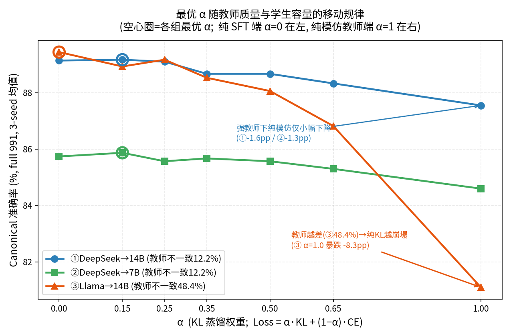
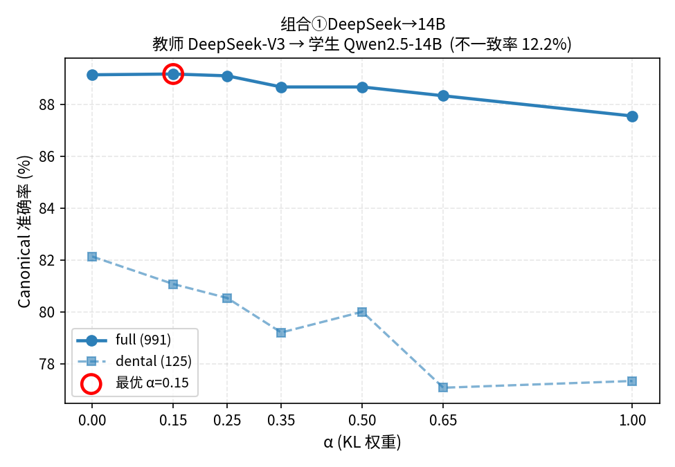
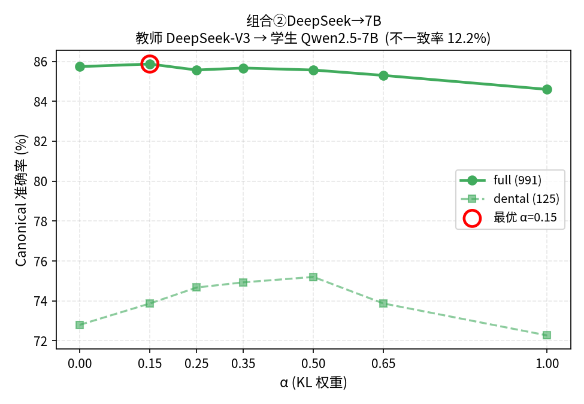
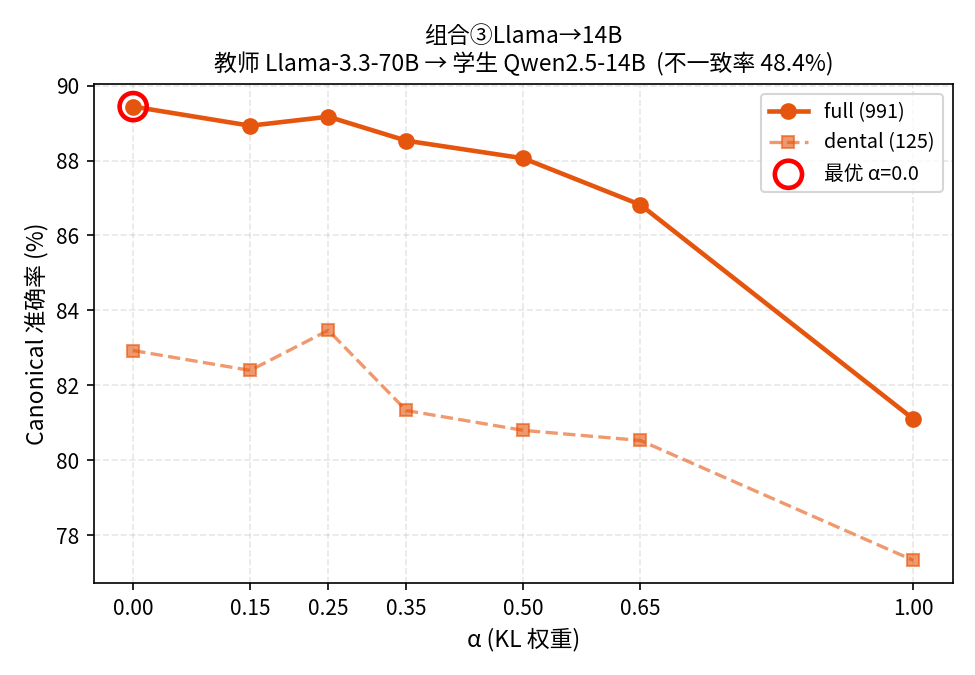

# 软标签蒸馏权重 α 的最优值如何随教师质量与学生容量移动
## ——CMExam 中文医学多选题上的三组对照消融研究（最终报告）

**作者**：陈天元　**单位**：珠海学院　**日期**：2026-06-22
**口径声明**：本报告所有准确率数字均出自统一的**标准化评测协议**（即下文的 canonical 评测协议，定义见第二节），三组实验、所有 α、所有种子严格同口径，可直接横向比较。

---

## 摘要

知识蒸馏中，软标签损失的权重 α 控制"模仿教师"与"拟合标准答案"的配比：

> **Loss = α · KL(teacher ‖ student) + (1 − α) · CE(标准答案, student)**

α=0 是纯监督微调（只学标准答案），α=1 是纯模仿教师软标签。我们在中文医学多选题数据集 CMExam（全科 7 学科，991 题主测试集）上，对三组 (教师 × 学生) 组合各做了完整的 α 网格消融，覆盖**教师质量**与**学生容量**两个正交维度：

| 组合 | 教师 → 学生 | 教师答案与标准答案不一致率 | 维度定位 |
|------|-----------|--------------------------|---------|
| ① | DeepSeek-V3 → Qwen2.5-14B | 12.2% | 强教师 + 强学生（基准） |
| ② | DeepSeek-V3 → Qwen2.5-7B | 12.2% | 强教师 + 弱学生（变容量） |
| ③ | Llama-3.3-70B → Qwen2.5-14B | 48.4% | 弱教师 + 强学生（变教师质量） |

**主结论**：在 CMExam 这类小决策空间（5 选 1）任务上，软标签 KL 的边际价值有限，且其符号由教师质量与学生容量共同决定，规律可被预测：

1. **学生越弱，最优 α 越往右移**：②（7B）最优 α=0.15，①（14B）最优落在 0~0.15 平台。
2. **教师越差，纯模仿崩塌越狠**：③（教师不一致 48.4%）α=0 最强烈最优，纯 KL（α=1.0）暴跌 −8.34pp 至 81.10%（低于无蒸馏基线）；而强教师组（①②）纯 KL 仅下降 1.3~1.6pp。

机制上，5 选 1 决策空间下软标签携带的类间信息有限，真正的增益来自决策空间监督（Choice-Head）本身，而非 Hinton 式 dark knowledge（暗知识）；教师越不可靠，模仿其软标签的代价越大。所有预先登记的预测全部命中。

---

## 一、研究背景与动机

我们已发表的 AIEA 工作（*Choice-Head Distillation for Dental MCQ*）证明：在 5 选 1 的答案空间内只蒸馏教师对五个选项的分布（而非全词表），可让 Qwen2.5-14B 学生超越 DeepSeek-V3 教师（best 89.10% > teacher 87.18%）。该论文主设置取 **α=0.35**，并已定稿、不再修改。

但在固定该组合扫描 α 时，我们观察到一个反直觉现象：**α 越小（越不依赖教师软标签）准确率越高，α=0 附近最优，加大 KL 权重单调变差**。这立刻引出一个对审稿人致命的质疑——

> 这究竟是"软标签价值有限"的一般规律，还是只是 (DeepSeek-V3, 14B) 这一个组合的偶然？换个更弱的学生、或换个更差的教师，结论会不会反转？

AIEA 论文自己的局限性一节也明确写道：当前只验证了"单一强教师 + 窄学生族"，**后续工作应测试更多教师质量、更多学生规模、更多医学子域**。本报告正是为回答这个质疑、兑现这条后续工作而做。

我们沿两个正交维度各动一格，构成 L 形对照：
- **沿学生容量**：学生从 14B 换成 7B（②），教师不变；
- **沿教师质量**：教师从 DeepSeek-V3（不一致 12.2%）换成 Llama-3.3-70B（在子集上不一致 48.4%），学生不变（③）。

这样能分别隔离两个维度对"最优 α"的影响。

---

## 二、实验设计与评测口径

### 2.1 标准化评测协议（canonical evaluation，全报告唯一口径）

为保证三组跨模型、跨实验严格可比，所有数字都用同一套**标准化评测协议**产出（英文文献常称 canonical evaluation，意即"作为统一基准的、规范固定的评测口径"）。它把评测全流程的四个要素一次性固定下来，任何一组实验都不得自行更改：

1. **固定提示词模板**：教师生成标签与学生测试用同一套 prompt 模板；
2. **固定答案抽取规则**：在闭合的五选项答案空间内做精确匹配（exact-match），不接受自由文本；
3. **固定打分口径**：full 测试集 991 题为主指标，dental 子集 125 题为敏感性参照；
4. **固定数据划分**：CMExam 重新划分 70/15/15，train/val/test = 4608/991/991，按难度分层。

因为四要素全程锁死，不同模型、不同 α、不同种子跑出来的准确率才真正可比，差异只反映模型本身而非评测设置的变动。

**与 AIEA 表格的关系**：AIEA 表 I 的数字来自训练框架的内置评测；本报告把三组的全部 α 点都用上述标准化协议重新评了一遍，这样 ①②③ 才能无缝叠在同一张图上做横向比较。此外，本报告统一使用经过校核的单路评测器 `evaluate_model.py` 直接评测，而非早期一个存在缺陷的**双路评测脚本**（run_eval_dual.py，会对同一模型走两条评测路径再合并，曾因合并逻辑 bug 给出不一致的分数，故弃用）。

### 2.2 消融设计

- **α 网格**：{0, 0.15, 0.25, 0.35, 0.50, 0.65, 1.0}，每个 α 跑 3 个随机种子（11/42/8），报告 3-seed 均值；
- **只训练 Stage-1**（Choice-Head 蒸馏头），不接 Stage-2，以隔离 α 的纯效应；
- **学习率**：①③ 用 1e-4，②（7B）用 1.2e-4（容量不同需单独调，不可混用）；
- **③ 的数据**：Llama 教师的可信子集（clean_teacher，2223 条，教师答案与标准答案不一致率 48.4%），软标签齐全无缺失。

**教师不一致率**（教师给出的答案与标准答案不符的比例）作为"教师质量"的天然因果代理：DeepSeek-V3 在全量训练集上不一致 12.2%（即 87.8% 答对），Llama 子集 48.4% 不一致——这是一条天然的因果梯度，让我们能观察"教师越不可靠，模仿它的代价如何变化"。

---

## 三、实验数据

### 3.1 头条核心规律图

一张图叠三条 α 曲线（横轴 α 从纯 CE 的 0 到纯模仿的 1，纵轴 canonical full 准确率），空心圈标各组最优 α。两个维度的规律一眼可见：①②（强教师）纯模仿端仅小幅下沉；③（弱教师）在 α 增大后急剧塌方，α=1.0 跌到 81%。

### 3.2 三组完整结果（标准化评测 full 991，3-seed 均值，%）

| α | ① DeepSeek→14B | ② DeepSeek→7B | ③ Llama→14B |
|----|----------------|----------------|--------------|
| 0.00 | **89.14** | 85.74 | **89.44** |
| 0.15 | **89.17** | **85.87** | 88.93 |
| 0.25 | 89.10 | 85.57 | 89.17 |
| 0.35 | 88.67 | 85.67 | 88.53 |
| 0.50 | 88.67 | 85.57 | 88.06 |
| 0.65 | 88.33 | 85.30 | 86.82 |
| 1.00 | 87.55 | 84.60 | **81.10** |

（粗体=该组最优点 / 纯 KL 端最差点。①的 α=0.15(89.17) 与 α=0(89.14) 实质并列，构成 0~0.25 平台。）

**对照锚点**（来自 AIEA / 基线，均为标准化口径或可比口径）：
- DeepSeek-V3 教师 full = 87.18%；Qwen2.5-14B 零样本基线 = 83.55%；Qwen2.5-7B 零样本基线 = 76.49%。
- AIEA 主设置 α=0.35：14B 3-seed 均值 88.67%（与本报告 ① α=0.35=88.67 一致），best 单次运行 89.10%。
- 旧 Llama→14B 单点实验（α=0.35，非消融）：3-seed full ≈ 87.25%，仅作背景，非本研究的 α 曲线。

### 3.3 三组分曲线（full + dental 双线）

### 3.4 跨维度规律矩阵

| 组合 | 教师/学生 | 教师不一致率 | 最优 α | 纯 KL(α=1.0) 跌幅 |
|------|----------|-------------|--------|-------------------|
| ① | DeepSeek/14B | 12.2% | 0（~0.15 平台） | −1.59pp（89.14→87.55） |
| ② | DeepSeek/7B | 12.2% | **0.15（右移）** | −1.27pp（85.87→84.60） |
| ③ | Llama/14B | 48.4% | 0 | **−8.34pp（89.44→81.10，崩塌）** |

---

## 四、实验结论

1. **α=0 在所有三组都不劣于任何正 α。** 软标签 KL 在 CMExam 这类小决策空间任务上没有稳定正增益，最优配比一律落在 α 偏低端。

2. **学生容量维度（② vs ①）**：学生从 14B 缩到 7B 后，最优 α 从 0~0.15 平台明确右移到 0.15。弱学生拟合标准答案的能力更弱，软标签的正则与平滑此时有微弱正向价值，但增益仅 +0.13pp（在 seed 噪声边缘）。7B 整体比 14B 低约 3.4pp，**全部未超过教师 87.18%**——"学生超越教师"是 14B 独有现象，受容量下限约束。

3. **教师质量维度（③ vs ①）**：教师换成高不一致（48.4%）的 Llama 子集后，α=0 优势更鲜明，纯 KL 从"轻微下降"变为"彻底崩塌"——①只跌 1.59pp，③暴跌 8.34pp 到 81.10%（甚至低于无蒸馏基线 83.55%），且 α=0.65→1.0 之间出现悬崖（86.82→81.10）。教师越不可靠，蒸馏权重越应趋零。

4. **预先登记的预测全部命中。** 我们在跑实验之前就把对组合③的三条预测写定、存档、事后不再改（见文末索引的预测登记文件）：③纯 KL 崩塌远比①严重、③ α=0 优势更大、③ KL 惩罚曲线更陡（0.65→1.0 悬崖）——结果三条全部应验，说明规律不是事后凑出来的故事。

---

## 五、理论分析

**为什么 KL 软标签在这个任务里增量这么有限？**

1. **决策空间太小**：CMExam 是 5 选 1。教师 softmax 在 5 个类上的分布能携带的"类间暗知识"，远少于 ImageNet 那种上千类场景。Hinton 式 dark knowledge（暗知识）的前提（丰富的类间相对相似度结构）在这里基本不成立。

2. **真正的增益来自决策空间监督**：Choice-Head 把"在选项空间里做结构化决策"这件事本身教给了学生，这部分增益与 α 无关——所以 α=0 时性能已最好。软标签是附加项，不是主因。

3. **强学生能直接拟合标准答案**：14B 容量足够，直接用交叉熵（CE）学标准答案即可逼近上界，软标签的平滑反而引入噪声；7B 容量不足时软标签的正则价值才略显（故 ②最优 α 右移）。

4. **教师可靠性决定 KL 的符号**：KL 把学生拉向教师分布。教师对（①②）时这是温和正则；教师错得多（③）时这是把学生拖向错误——所以同样加 KL，③崩、①只微降。

**一句话**：在小决策空间任务里，蒸馏的价值主要是"教会决策结构"而非"传递软标签暗知识"；软标签的边际价值由教师可靠性与学生容量共同决定，且常常为零或负。

---

## 六、对原有论文（AIEA）的影响

本报告与已定稿的 AIEA 论文不冲突，且在三处强化、澄清、兑现了它：

1. **兑现了 AIEA 的后续工作。** AIEA 局限性一节明确要求"测试更多教师质量、更多学生规模、更多医学子域"。本三组消融恰好沿教师质量（DeepSeek→Llama）与学生容量（14B→7B）两维补齐，把 AIEA 的单点结论扩展为有对照的规律。

2. **实证印证了 AIEA 的核心直觉。** AIEA 在方法一节写"过拟合教师标签会放大其错误（overfitting teacher labels can amplify its errors）"，但只是定性判断。③Llama 的 −8.34pp 崩塌给了这句话直接的定量证据：当教师近半数答案错误时，纯模仿确实把错误放大到崩盘。

3. **澄清了 α=0.35 主设置的性质。** AIEA 取 α=0.35 并报告 best 89.10%。标准化消融显示 α=0.35（88.67 均值）并非最优，真正最优在 α=0~0.15（89.14~89.17 均值）。这**不否定** AIEA 的结论（α=0.35 仍显著优于基线、仍支撑"学生超越教师"），但说明：AIEA 的增益主要来自决策空间监督而非软标签，KL 权重本可更低甚至取零。被问及 α 选择时可诚实补充这一点。

4. **支撑了 AIEA 关于 Stage-2 的判断。** AIEA 称 Stage-2 硬标签校准"其有用性取决于学生容量、教师可靠性、数据规模"。本报告把这一判断量化到了 Stage-1 内部的 α 维度：最优 α 确实随学生容量（②右移）和教师可靠性（③更偏 0）系统性移动，与 AIEA 的定性表述同向。

**结论**：AIEA 定稿无需改动；本报告作为其后续扩展，把"软标签价值有限、决策空间监督是主因"从单组合观察升级为跨维度规律，并为 AIEA 列出的后续工作提供了完整答卷。

---

## 七、诚实边界（可质疑点逐条声明）

按"每个结论都要经得起质疑"的要求，主动列出本研究的弱点与边界：

1. **①的最优不是严格 α=0，而是 0~0.25 平台**：α=0.15(89.17)≈α=0(89.14)≈α=0.25(89.10)，差异在 seed 噪声内。主张应表述为"α=0 不劣于任何正 α"，而非"α=0 严格唯一最优"。

2. **小样本方差**：dental 子集仅 125 题，单点波动可达 1~2pp，仅作敏感性参照不作主结论。③的 Llama 教师只用 2223 条可信子集，样本量小于①②的全量，跨组绝对值比较需谨慎；我们主要比较**组内 α 趋势**，趋势比绝对值稳健。

3. **单一数据集**：全部基于 CMExam（中文医学）。"小决策空间 → 软标签价值有限"的机制应能外推到其他 N 选 1 选择题任务，但**未在 CMExam 之外验证**，不宣称跨任务普适。开放域生成、大类别分类等场景结论可能不同。

4. **③的崩塌部分由子集偏置放大**：48.4% 不一致是可信子集的特性，比 Llama 在全量上的不一致率更极端，放大了"弱教师"效应。它对"教师越差 KL 越有害"是有利证据，但读者应知道这是被选择强化过的对照工况，而非典型工况。

5. **两个维度未做全因子交叉**：缺"弱教师 + 弱学生"（Llama→7B）这一格，无法分离两维度的交互项。当前是 L 形对照而非 2×2 全因子，交互效应未知。

6. **教师不一致率作为"教师质量"代理的局限**：不一致率只衡量首选答案是否对标准答案，未刻画教师 softmax 分布的校准度（calibration）。两个不一致率相同的教师，软标签信息量仍可能不同。

7. **学习率非完全对齐**：②用 1.2e-4、①③用 1e-4。虽各自为容量调过，但严格说"学生容量维度"里混入了学习率这一干扰变量。

---

### 数据与脚本索引（复现用）

- 三组标准化评测原始日志：`21_ablation/logs/{canon14b_backfill,ablation_7b_priority,ablation_llama_priority}.log`
- 绘图脚本与结构化数据：`21_ablation/scripts/make_ablation_figs.py`、`21_ablation/figs/ablation_data.json`
- 组合③训练数据：`21_ablation/data/llama_clean2223_train.jsonl`（2223 行）
- 预测登记文件（实验前写定、存档不改）：`aiea/alpha_ablation_matrix_plan.md`；①详细结果：`aiea/alpha_ablation_results.md`
- 原 AIEA 论文：`aiea/aiea_DentalMCQ_Distillation_2026-06-20_EN - 0030.docx`
- 旧 Llama 单点对照（α=0.35，非消融，均值≈87.25%）：`16_llama70b_choice_head/runs/20260416_091507_llama70b_14b/eval_results.json`
