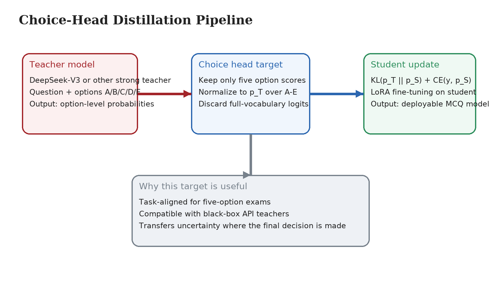
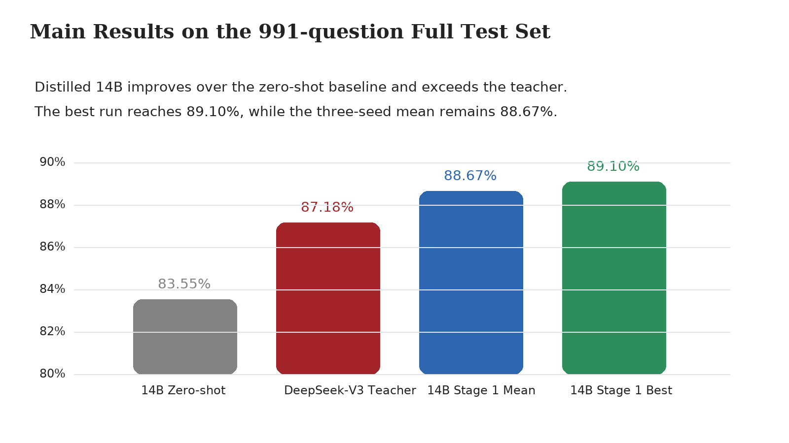

Choice-Head Distillation for Dental Multiple-Choice Question Answering

Tianyuan Chen

Master of Science in Applied Artificial Intelligence

Hong Kong Chu Hai College, Hong Kong SAR, China

Supervisor: Dr. Richard Tai-Chiu Hsung, Associate Professor, Department of Computer Science, Hong Kong Chu Hai College

Abstract

Medical large language models achieve strong scores on exam benchmarks, but they remain expensive to deploy. This problem is pronounced in dental multiple-choice question answering, where the output space is limited to five options but many distillation methods still supervise the full vocabulary. This paper proposes Choice-Head distillation, which transfers only the teacher distribution over the answer options. The method is task-aligned, computationally lighter than vocabulary-level distillation, and compatible with black-box API teachers. Experiments use DeepSeek-V3 as the teacher and Qwen2.5-7B and Qwen2.5-14B as students on a CMExam-based resplit. The evaluation emphasizes a 991-question full test set and reports repeated runs so that the main conclusion is not tied to a single favorable seed. On the 991-question full test set, the best 14B student reaches 89.10% accuracy, exceeding the 87.18% teacher, while the three-seed mean remains 88.67%. The results also show that a second hard-label fine-tuning stage is not always beneficial after option-level structure has already been transferred. These findings indicate that, for structured medical multiple-choice tasks, decision-space distillation is not only cheaper than vocabulary-level supervision but also a stronger target for deployable student models.

Keywords

knowledge distillation; medical question answering; large language models; multiple-choice reasoning; decision-space supervision

# Introduction

Knowledge distillation compresses large models by transferring soft targets to smaller students [1]-[4]. Recent medical and general-purpose language models also motivate this direction because strong benchmark results often come with high inference cost and limited deployability [5], [6]. In exam-style medical QA, this trade-off is especially important because the deployment target is often a smaller assistant model rather than the largest available teacher.

This paper studies dental multiple-choice question answering, a five-option decision task. The task structure is simple, but many distillation pipelines still use full-vocabulary logits or free-form targets. That design is inefficient for a fixed-choice problem and is hard to use with API teachers that do not expose internal logits.

Another practical issue is evaluation reliability. Small medical QA test sets can make model ranking unstable because one or two questions may shift the reported accuracy by several points. This paper therefore emphasizes a CMExam-based resplit with a 991-question main test set, which provides a stronger basis for judging whether a student-over-teacher result is real.

We address this mismatch with Choice-Head distillation, which transfers only the teacher distribution over the five answer options. The method is task-aligned for five-option medical MCQs, and it can produce a student that outperforms its teacher: a Qwen2.5-14B student distilled from DeepSeek-V3 reaches 89.10% accuracy on a 991-question CMExam test set, above the teacher accuracy of 87.18%.

Figure 1. Choice-Head distillation keeps only the option-level teacher signal and combines KL supervision with the gold-label cross-entropy loss.

# Related Work

Classic distillation transfers softened target distributions from a teacher to a student [1]. Later work extends this idea to compact transformer models, parameter-efficient adaptation, and toolkits for large-scale compression [2]-[4]. In language models, the usual target remains the token vocabulary distribution.

For medical QA, stronger teachers and larger evaluation sets have improved reported performance [6], [7]. In fixed-choice exams, however, vocabulary-level targets are not always well aligned with the downstream decision. Our method instead treats the answer-option distribution, not the full vocabulary, as the transfer object.

The downstream task is classification-like even though the underlying models are generative. In a five-option exam, most of the vocabulary is unrelated to the final decision. A task-aligned target therefore simplifies training while preserving the uncertainty structure that affects the answer choice.

This difference is operationally important when the teacher is accessed through an external API. In that setting, full-vocabulary distillation is often unavailable or too expensive because the system cannot expose internal logits at scale. Option-level targets are easier to collect, easier to verify, and easier to align with the final benchmark. The design therefore reduces not only training complexity but also data-collection friction.

# Method

## Problem Setting

Given a multiple-choice question $x$ with five candidate answers, the goal is to predict the correct option $y \in \{A, B, C, D, E\}$. Let $p_T$ be the teacher distribution over the five options and $p_S$ be the student distribution over the same options.

Traditional distillation minimizes divergence over the full token vocabulary. In contrast, we distill only the distribution over the decision-relevant option set.

## Choice-Head Distillation

Stage 1 training combines distillation and ground-truth supervision:

$$
L = \alpha D_{KL}(p_T \parallel p_S) + (1-\alpha)L_{CE}.
$$

(1)

In the main setting, $\alpha = 0.35$. Compared with vocabulary-level distillation, this objective matches the task output space, removes irrelevant supervision dimensions, and works with black-box teachers.

The method is lightweight in practice. It does not require hidden-state matching, rationale generation, or full-logit access. The teacher only needs to provide a calibrated relative preference over the five answer options, which makes the pipeline practical for API teachers.

This design is also simpler to debug than full-vocabulary distillation. When the downstream task is fixed-choice, the transferred signal can be checked directly at the option level instead of being buried in a large token distribution. That property is useful in a medical setting, where training failures need to be traced to concrete answer behavior rather than to opaque language-model internals.

## Training Strategy

The broader project also tested a second stage that applies ground-truth supervised fine-tuning after Stage 1. For the strongest 14B student, however, Stage 2 does not help and can be mildly harmful. The best-performing 14B configuration therefore uses Stage 1 only.

Stage 1 transfers option-level structure, while Stage 2 pushes the model toward the hard gold label. For stronger students, that second update can over-calibrate the model and weaken the soft-label geometry learned in Stage 1. The best 14B configuration therefore stops after Stage 1.

# Experimental Setup

The evaluation uses a CMExam-based resplit with 6,591 single-choice medical questions across seven subjects [7]. The train, validation, and test splits contain 4,608, 991, and 991 questions. A 125-question dental subset is retained for specialty-focused analysis.

The resplit follows a 70/15/15 partition and is stratified by difficulty, which makes the large test set more representative than the small specialty-only setting used in earlier experiments. A 991-question test does not eliminate uncertainty, but it reduces the chance that a strong result is caused by a favorable sample rather than by a stable improvement in decision quality.

The teacher is DeepSeek-V3 [6]. The students are Qwen2.5-7B-Instruct and Qwen2.5-14B-Instruct [5]. Training uses LoRA with rank 16 and LoRA alpha 32 [3]. For the main 14B setting, Stage 1 is run for one epoch with learning rate $1 \times 10^{-4}$.

Teacher labels cover the full training split. In the full-data setting, the teacher and ground truth disagree on about 12.2% of the training questions. This shows that the teacher provides nontrivial relative preferences instead of merely repeating the gold label, while remaining stable enough to serve as a useful transfer source.

Evaluation reports both the 991-question full test set and the 125-question dental subset. The former is the main benchmark used for claims about overall effectiveness. The latter is retained for domain-specific inspection, but its smaller size makes it more sensitive to variance and therefore less suitable as the sole basis for a central conclusion.

To reduce run-to-run noise, the main comparisons use repeated runs under the same data split and prompt format. This matters because a student-over-teacher claim is only meaningful if the margin is reproducible across seeds rather than produced by a single favorable trial. The reported mean and best results are therefore both useful: the mean reflects stability, while the best run shows the upper bound of the same training recipe.

All evaluations use exact-match accuracy on the final option choice. The prompt format is kept fixed across teacher and student runs so that the comparison reflects model quality rather than prompt engineering differences. This protocol is intentionally simple. The goal of the paper is not to maximize performance through elaborate prompting, but to isolate the effect of decision-space supervision under a controlled and reproducible setup.

The evaluation protocol also keeps the answer space strictly closed during both label generation and testing. Each question is decoded into one of the five predefined options rather than into free-form natural language. This detail matters because it removes a common source of noise in medical QA benchmarking: a model may express a clinically reasonable explanation while still failing to commit to a valid option string. By constraining teacher and student outputs to the same closed decision interface, the reported accuracy measures the quality of the final answer choice itself. That makes the comparison cleaner and better aligned with the conference paper's central claim, which concerns decision-space transfer rather than general text generation quality.

# Results and Discussion

Table 1. Main results on the CMExam full-data and dental test sets.

| Model | Setting | Full Test Accuracy | Dental Test Accuracy |
| --- | --- | ---: | ---: |
| Qwen2.5-7B | Zero-shot baseline | 76.49% | 68.80% |
| Qwen2.5-14B | Zero-shot baseline | 83.55% | 74.40% |
| DeepSeek-V3 | Teacher | 87.18% | 79.20% |
| Qwen2.5-7B | Stage 1 mean | 85.60% | 73.60% |
| Qwen2.5-14B | Stage 1 mean | 88.67% | 79.20% |
| Qwen2.5-14B | Stage 1 best | 89.10% | 78.40% |

Full Test = 991-question full test set. Dental Test = 125-question dental subset.

The method improves both student sizes. On the full test set, the 7B student rises from 76.49% to 85.60%, a gain of 9.11 percentage points. The 14B student rises from 83.55% to 88.67% on average, a gain of 5.12 percentage points. The best 14B run reaches 89.10%, which exceeds the 87.18% teacher.

Figure 2. Main comparison on the 991-question full test set. The distilled 14B student exceeds both its zero-shot baseline and the teacher.

The result is strong not only in peak accuracy but also in stability. Across three seeds, the 14B distilled model ranges from 88.40% to 89.10%, a spread of only 0.70 percentage points. The mean and the best run tell the same story: the task-aligned student is consistently competitive with, and in the best case superior to, the teacher.

The main conclusion should be read from the full 991-question test set rather than from the smaller dental subset. On the main benchmark, the distilled 14B student is stronger than both its zero-shot baseline and the teacher.

The dental subset still has diagnostic value. It shows that the distilled students do not gain only by fitting broad exam style; they also remain competitive on the target specialty slice. At the same time, the smaller subset is more volatile, so it should be used as supporting evidence rather than as the primary basis for ranking models.

The 7B results show that the method is not restricted to a single model size. The 7B student improves by more than nine points on the full test set and remains above its own zero-shot baseline on the dental subset. This matters because distillation is often motivated by the need to improve smaller and cheaper models first.

The student-over-teacher result does not mean the teacher is weak. It suggests that a task-aligned student can combine teacher uncertainty with direct task optimization to learn a stronger decision boundary. Another practical finding is that Stage 2 is not always beneficial. For a strong 14B student, extra ground-truth fine-tuning can erase useful soft-label structure instead of improving it.

Additional runs suggest that this is not a one-off effect limited to the 14B student. In the same 991-question setting, the 7B Stage 1 mean reaches 85.60%, while the corresponding Stage 2 mean is 85.20%. Once the decision-space structure has been transferred effectively, extra hard-label correction does not necessarily improve the final model.

This pattern is consistent with the task itself. In a five-option exam, the most useful teacher signal is the relative relation among the answer choices. Stage 1 preserves that structure, whereas Stage 2 pushes the model toward a single hard label. When the student is already strong, the second step can remove useful uncertainty information rather than refine it.

The same result has direct engineering value. A 14B student that exceeds the teacher on the main benchmark is easier to host, cheaper to query repeatedly, and simpler to integrate into fixed-choice tutoring or assessment systems than a frontier-scale teacher model. The 7B gains matter for the same reason: they move a much smaller model from a weak baseline into a range that is practically useful.

The gain pattern also helps explain where the method is most useful. The largest practical benefit does not come from squeezing a small extra margin out of an already strong teacher. It comes from moving a smaller student into a performance range that is deployable under tighter cost, latency, and memory constraints. In that sense, the teacher-over-student transfer should be judged not only by final accuracy, but also by how much usable capability is preserved after compression.

The student does not learn every aspect of the teacher. It learns a compressed, task-focused view of the teacher signal while also being optimized for the benchmark objective. That combination can act as regularized transfer: the student inherits useful uncertainty patterns without imitating irrelevant parts of the teacher distribution.

One useful way to read the results is through calibration rather than through raw imitation. The teacher supplies a relative preference structure over the five options, but the student is trained under the same benchmark objective that will later be used at test time. The distilled model therefore does not need to reproduce every teacher decision exactly. Instead, it only needs to absorb the part of the teacher signal that improves ranking among the candidate answers. This can explain why the student occasionally outperforms the teacher even though the teacher remains stronger in a more general sense. The student is narrower, but it is narrower in the right way for the downstream task.

This interpretation is consistent with the disagreement statistics in the training data. Because teacher labels and gold labels differ on a nontrivial fraction of examples, the student is exposed to cases where the correct answer is not simply copied from one source. The optimization problem therefore has two informative signals: the teacher's option-level uncertainty and the benchmark's hard correctness target. When these signals are combined in a restricted five-way output space, the student can learn a smoother decision boundary than one obtained from hard labels alone. In practice, this looks less like teacher cloning and more like task-specific regularization.

The result also suggests that option-level supervision improves sample efficiency. A full-vocabulary target spreads probability mass across many tokens that have no role in the final multiple-choice decision. In contrast, a five-option target concentrates every update on the decision variables that matter at evaluation time. This does not guarantee improvement on every task, but it is a plausible reason why the current method produces large gains with a relatively simple training recipe. The training signal is denser, the debugging surface is smaller, and the mismatch between supervision and evaluation is reduced.

Overall, the method works because it keeps only the uncertainty structure that matters for the final option choice and discards irrelevant supervision dimensions.

The result is strongest for structured five-option medical exams and should not be over-generalized to open-ended clinical dialogue or rationale generation. Within this setting, decision-space supervision is not merely a cheaper approximation to full-vocabulary distillation; it can be the better training target. The main practical lesson is simple: when the downstream output space is small and explicit, the teacher signal should be compressed into that same space instead of being transferred through the entire vocabulary.

The same reasoning suggests a broader design rule for medical exam models. When the task is judged by a small set of explicit answer options, the training target should match that decision surface as closely as possible. If the supervision target is broader than the task itself, the student spends capacity modeling information that does not affect the final score. The present results indicate that this mismatch is not merely inefficient; it can also weaken the final model.

# Practical Implications and Limitations

The main practical implication is that decision-space distillation changes the deployment trade-off. Instead of asking whether a smaller student can perfectly reproduce a large teacher, the method asks whether the student can preserve the part of the teacher signal that directly affects the final option choice. For standardized medical MCQs, that is the decision that matters in practice. This framing is useful for educational systems, exam preparation tools, and low-cost assessment services, where inference cost, model size, and operational simplicity matter as much as benchmark accuracy.

The results also clarify when the method should be preferred over more general distillation objectives. If the downstream task is evaluated by a small and explicit answer set, then transferring a full-vocabulary distribution may add cost without adding useful supervision. In that setting, option-level transfer provides a cleaner training signal and a simpler debugging path. When the student fails, the failure can be inspected directly at the answer-choice level instead of being buried in a large token distribution that is only indirectly related to the final decision.

At the same time, the method has clear limits. The present experiments focus on fixed-choice dental and medical exam questions. They do not show that the same target is sufficient for open-ended diagnosis, rationale generation, or interactive clinical dialogue. Those tasks depend on broader language behavior and would require a different supervision target. The current evidence therefore supports a task-specific claim: for structured five-option exams, decision-space supervision is effective; it should not yet be treated as a general replacement for language-model distillation.

Another limitation is that the current study evaluates a single strong teacher and a narrow family of student architectures. That is enough to establish the central result, but not enough to show that every teacher-student pair will behave the same way. Future work should test whether the same pattern holds across more teacher qualities, more student sizes, and more medical subdomains. A second extension is to combine decision-space supervision with selective data filtering, so that ambiguous or low-value training cases are handled differently from clear high-signal examples.

There is also a measurement limitation. Accuracy on a fixed-choice benchmark is appropriate for the present task, but it does not reveal whether the student is better calibrated in probability terms, whether it is more robust under paraphrased prompts, or whether it preserves medically useful reasoning patterns outside the answer letter. Those questions matter if the system is later extended from exam scoring to tutoring or explanation generation. A stronger follow-up study should therefore report calibration-sensitive metrics, controlled prompt variations, and targeted error analysis by subject and difficulty. Such analysis would help determine whether the observed improvement comes mainly from better confidence shaping, better subject knowledge transfer, or both.

From a systems perspective, the method is also attractive because it separates the expensive part of the pipeline from the deployable part. The teacher is used offline to produce option-level supervision, while the final student handles online inference. In an educational or assessment setting, this separation is practical. Institutions may be willing to pay the one-time cost of generating training labels with a large model, but they still need a smaller model for repeated local inference, lower latency, and predictable serving cost. Choice-Head distillation matches this workflow well because the transferred target is compact, task-specific, and easy to store alongside the original dataset.

This deployment angle also explains why the present paper focuses on direct answer accuracy rather than richer generative behavior. For a standardized multiple-choice examination assistant, the first requirement is reliable option selection under resource constraints. A method that preserves this capability in a smaller model already solves a meaningful engineering problem. Richer explanation quality can be layered on later, but only if the underlying answer decision is dependable. In that sense, the current work should be read as a strong baseline for constrained medical QA systems rather than as a complete solution to all forms of clinical language modeling.

# Conclusion

This paper presented Choice-Head distillation for dental multiple-choice question answering. The method distills only the five-option answer distribution, not the full vocabulary. This makes the supervision target closer to the task and keeps the framework compatible with black-box teachers. On the 991-question CMExam-based test set, the best 14B student reaches 89.10% accuracy and exceeds the 87.18% DeepSeek-V3 teacher. The corresponding three-seed mean of 88.67% shows that the gain is not restricted to a single run. For structured medical multiple-choice tasks, decision-space distillation is therefore a practical path to smaller and more deployable QA systems.

More broadly, the study suggests a simple design principle: when the downstream task has a small and explicit decision space, distillation should be defined in that same space unless broader supervision is clearly necessary. In this setting, the smaller target is not a compromise; it is the reason the transfer is both efficient and effective. This is the main practical value of the method: it improves deployability without reducing the task to a weaker approximation of the teacher.

References

[1] G. Hinton, O. Vinyals, and J. Dean, "Distilling the Knowledge in a Neural Network," in NIPS Deep Learning and Representation Learning Workshop, Montreal, Canada, 2015. Available: https://arxiv.org/abs/1503.02531

[2] V. Sanh, L. Debut, J. Chaumond, and T. Wolf, "DistilBERT, a distilled version of BERT: smaller, faster, cheaper and lighter," arXiv:1910.01108, 2019. Available: https://arxiv.org/abs/1910.01108

[3] E. J. Hu et al., "LoRA: Low-Rank Adaptation of Large Language Models," arXiv:2106.09685, 2021. Available: https://arxiv.org/abs/2106.09685

[4] X. Liu et al., "TextBrewer: An Open-Source Knowledge Distillation Toolkit for Natural Language Processing," arXiv:2002.12620, 2020. Available: https://arxiv.org/abs/2002.12620

[5] Qwen Team, "Qwen2.5 Technical Report," arXiv:2412.15115, 2024. Available: https://arxiv.org/abs/2412.15115

[6] DeepSeek-AI, "DeepSeek-V3 Technical Report," arXiv:2412.19437, 2024. Available: https://arxiv.org/abs/2412.19437

[7] T. Liu et al., "Benchmarking Large Language Models on CMExam: A Comprehensive Chinese Medical Exam Dataset," in Advances in Neural Information Processing Systems, 2023, doi: 10.52202/075280-2283.
