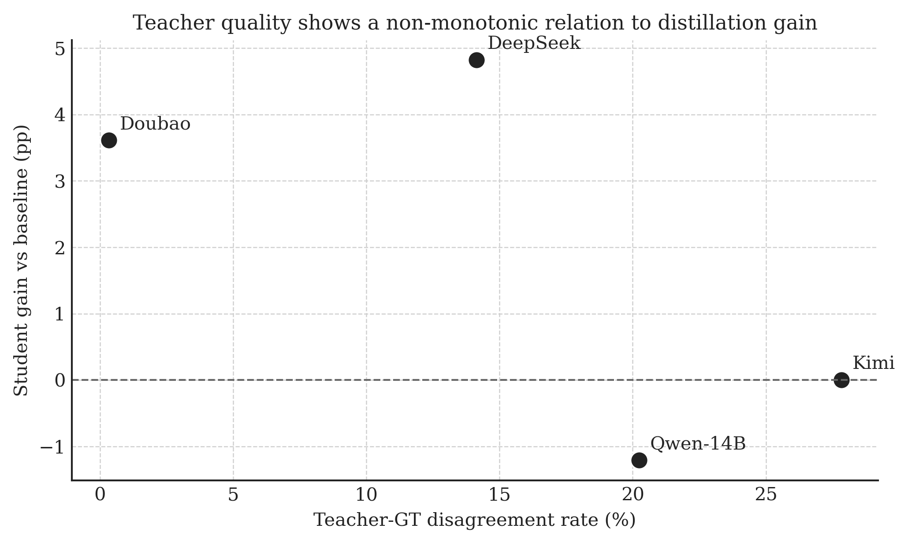
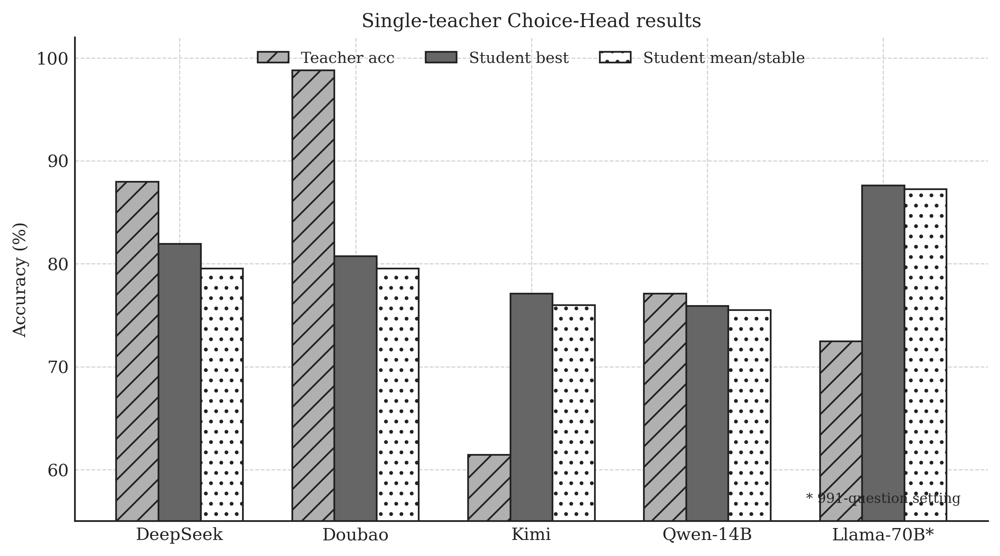
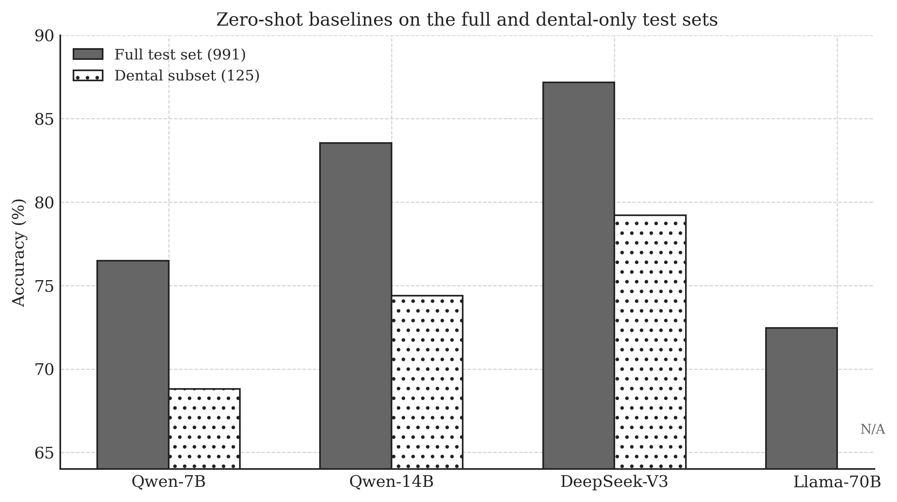
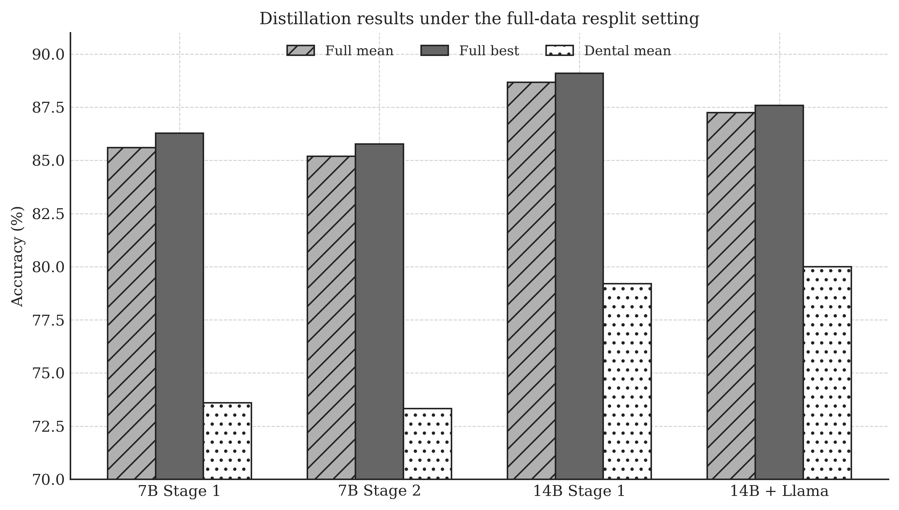
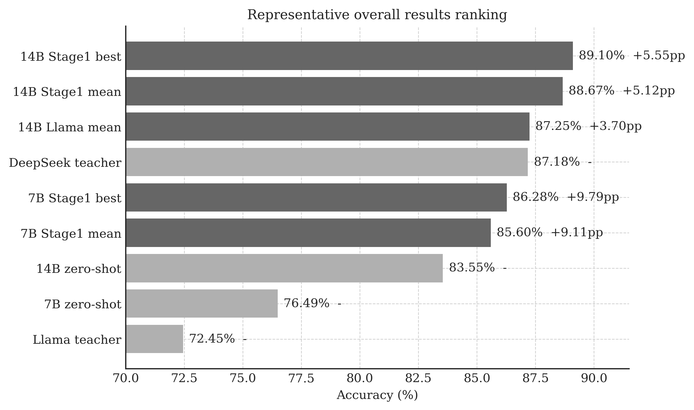

# 基于知识蒸馏的牙科选择题自动答题系统

## A Knowledge Distillation-Based Automatic Dental Multiple-Choice Question Answering System

---

**陈天元** (CHEN TIANYUAN)

学生编号：256360231

资讯科学学系 (Department of Computer Science)

硕士论文（满足学位部分要求）

应用人工智能理学硕士 (Master of Science in Applied Artificial Intelligence)

**香港珠海学院** (HONG KONG CHU HAI COLLEGE)

导师姓名（职称）：熊体超博士（副教授）

Supervisor: Dr. Richard Tai-Chiu Hsung (Associate Professor)

日期：MAY 2026

\newpage

---

## 学位论文独创性声明

本人郑重声明：所呈交的学位论文，是本人在导师指导下独立完成的研究成果。除文中已经标明引用的内容外，本论文不包含任何其他个人或集体已经发表或撰写过的研究成果。对本文研究做出贡献的个人和集体，均已在文中以明确方式标明。本人完全意识到本声明的法律效力。

学位论文作者签名：______________

日期：____年____月____日

\newpage

---

## 学位论文版权使用授权声明

本学位论文作者完全了解香港珠海学院有关保留、使用学位论文的规定，即：学校有权保留并向有关部门或机构送交论文的复印件和电子版，允许论文被查阅和借阅。

学位论文作者签名：______________    导师签名：______________

日期：____年____月____日          日期：____年____月____日

\newpage

---

## 摘要

牙科智能问答若要服务于患者教育与分诊辅助，其核心问题不在于模型规模本身，而在于高性能能力能否以可承受的成本完成部署。针对这一问题，本文以牙科医学选择题自动答题为研究对象，采用知识蒸馏（Knowledge Distillation, KD）方法，将大型教师模型的判别能力迁移到较小的学生模型，以同时兼顾准确率、部署成本与可复现性，并通过系统性对比实验分析教师类型、学生容量与标签形态对蒸馏效果的影响。

基于中国医师资格考试数据集 CMExam，本文面向牙科五选一选择题任务构建了可复现的评测设置，并在此基础上提出了 Choice-Head 两阶段蒸馏框架。该方法不再对全词表 logits 进行蒸馏，而是直接学习 A/B/C/D/E 五个候选选项上的概率分布，因此既能兼容黑盒 API 教师，也能显著降低显存与计算开销。

本文通过系统性的实验开展研究，包括蒸馏等方法研究中观察到一些值得注意的发现。第一，当前的大语言模型在进行压缩的同时，仍能达到并优于现有教师模型的性能。第二，目前的最先进模型（如 Qwen、DeepSeek 等）的蒸馏结果显示，教师模型质量与蒸馏之间存在“倒 U 型”关系。第三，基于 Fisher-Rao 距离与 α-散度的分析表明，真实 logprobs 标签较人工平滑标签保留了更丰富的连续结构信息，其体积密度高约 2500 倍。第四，异构教师同样可以提供有效蒸馏信号，72.45% 准确率的 Llama-3.3-70B 教师仍能蒸馏出达到 87.25% 的 14B 学生模型。

**关键词**：知识蒸馏；大语言模型；牙科人工智能；选择题自动答题；Choice-Head 蒸馏；信息几何；Fisher-Rao 距离；LoRA 微调

\newpage

## Abstract

For dental intelligent question answering to be useful in patient education and triage support, the central challenge lies not in model scale per se, but in whether strong performance can be deployed at an acceptable cost. To address this issue, this thesis studies the automatic answering of dental multiple-choice medical questions and adopts knowledge distillation (KD) to transfer the discriminative capabilities of large teacher models to smaller student models, thereby balancing accuracy, deployment cost, and reproducibility. Systematic comparative experiments are further conducted to examine how teacher type, student capacity, and label form influence distillation effectiveness.

Using the Chinese Medical Examination dataset CMExam, this thesis constructs a reproducible evaluation setup for dental five-option multiple-choice questions and, on this basis, proposes a two-stage Choice-Head distillation framework. Instead of distilling full-vocabulary logits, the proposed method directly learns the probability distribution over the five candidate options A/B/C/D/E. This design is compatible with black-box API teachers and substantially reduces memory and computational overhead.

The experiments yield several notable findings. First, current large language models can still match and even surpass existing teacher models after compression. Second, distillation results with state-of-the-art models such as Qwen and DeepSeek indicate an inverted-U relationship between teacher quality and distillation effectiveness. Third, analyses based on Fisher-Rao distance and α-divergence show that real log-probability labels preserve much richer continuous structural information than manually smoothed labels, with approximately 2,500 times higher volume density. Fourth, heterogeneous teachers can also provide effective distillation signals: a Llama-3.3-70B teacher with 72.45% accuracy can still distill a 14B student model that reaches 87.25%.

**Keywords**: Knowledge Distillation; Large Language Model; Dental Artificial Intelligence; Multiple-Choice Question Answering; Choice-Head Distillation; Information Geometry; Fisher-Rao Distance; LoRA Fine-tuning

\newpage

## 符号与缩写名称列表

| 缩写 | 英文全称 | 中文释义 |
|------|---------|---------|
| LLM | Large Language Model | 大语言模型 |
| KD | Knowledge Distillation | 知识蒸馏 |
| SFT | Supervised Fine-Tuning | 监督微调 |
| LoRA | Low-Rank Adaptation | 低秩适配 |
| KL | Kullback-Leibler (Divergence) | KL 散度 |
| CE | Cross-Entropy | 交叉熵 |
| MCQ | Multiple-Choice Question | 选择题 |
| GT | Ground Truth | 标准答案/真值 |
| CoT | Chain-of-Thought | 思维链/推理链 |
| NLP | Natural Language Processing | 自然语言处理 |
| API | Application Programming Interface | 应用程序接口 |
| MoE | Mixture of Experts | 混合专家模型 |
| FR | Fisher-Rao (Distance) | Fisher-Rao 距离 |
| PEFT | Parameter-Efficient Fine-Tuning | 参数高效微调 |
| BF16 | Brain Floating Point 16 | 脑浮点 16 位精度 |
| AWQ | Activation-aware Weight Quantization | 激活感知权重量化 |
| GPU | Graphics Processing Unit | 图形处理单元 |
| GQA | Grouped Query Attention | 分组查询注意力 |
| pp | Percentage Point | 百分点 |

\newpage

## 目录

第一章 绪论 ............................ 8  
第二章 研究背景与理论基础 ..................... 12  
第三章 设计与方法 ......................... 20  
第四章 实验结果与分析 ....................... 31  
第五章 讨论与结论 ......................... 45  
参考文献 .............................. 52  
附录 ................................ 54  
致谢 ................................ 57  
\newpage

## 第一章 绪论

### 1.1 研究背景

在医疗健康领域数字化转型的浪潮中，牙科作为与民众日常生活密切相关的细分领域，其信息服务的便捷性与专业性需求日益凸显。传统牙科咨询模式高度依赖线下门诊与专业医师的人工响应，受诊疗时间、地域分布、医师资源等因素限制，难以满足患者对牙科健康知识的即时性、常态化查询需求。近年来，以 GPT 系列、LLaMA、Qwen 为代表的预训练大语言模型相继涌现，在文本理解、生成和推理等任务上取得了突破性进展。在医疗领域，这些模型通过在大规模医学语料上进行预训练和微调，展现出对医疗专业文本的深度理解能力和高质量生成能力。

然而，当前商业级大语言模型的部署面临显著的资源瓶颈。以 DeepSeek-V3 为例，该模型拥有 671B 参数（稀疏混合专家架构，每次推理激活约 37B 参数），虽然在 83 题牙科测试集上达到了 87.95% 的准确率，但其推理需要大量 GPU 算力支持，单卡显存需求 40–90GB，API 调用也产生持续费用。对于基层医疗机构和个人开发者而言，直接部署这些大模型既不经济也不现实。知识蒸馏（Knowledge Distillation, KD）技术为解决这一矛盾提供了一种可行方案：通过将大型教师模型的知识迁移至参数量远小的学生模型，在保持可接受性能水平的同时，大幅降低推理成本和硬件需求。

### 1.2 研究动机

本研究的动机并非单纯追求更高的离线答题分数，而是试图回答一个更具实际部署导向的问题：牙科知识服务能否在资源受限条件下获得足够可靠的模型能力。围绕这一问题，本文的研究动机可归纳为三个相互关联的现实约束。

首先，牙科信息服务存在明显的可及性缺口。许多常见口腔问题并不一定需要患者立即进入诊疗流程，但患者往往缺少对症状、风险与就诊时机的基础判断依据。线下咨询受门诊时间、地区资源和医生工作负荷限制，难以持续提供低门槛、即时性的解释型信息服务。因此，一个面向牙科场景的智能问答系统不仅是一种技术方案，也具有明确的公共服务价值。

其次，现有高性能模型的使用门槛与部署成本过高。无论是本地运行所需的高端 GPU、显存与维护成本，还是商业 API 的持续调用费用，都使得先进模型很难直接下沉到基层机构、教学演示或隐私敏感环境。换言之，当前性能最优的模型可以作为能力上界，却未必适合作为最终交付形态，这就要求研究寻找一种低成本继承教师能力的技术路径。

最后，通用蒸馏方案与本任务之间存在方法错位。牙科考试数据是标准化五选一选择题，而传统蒸馏通常围绕全词表 logits 或自由文本生成展开，既带来高维冗余，也难适配 API 教师不可见内部状态的现实条件。相较于在通用方案上做高成本折中，直接围绕选择题的决策结构设计蒸馏目标，更有利于从任务头层面提取紧凑且可获得的监督信号。这一观察直接促成了本文后续的 Choice-Head 蒸馏框架。

### 1.3 研究目标

本研究的总体目标，是构建一套面向教学演示、标准化考试训练等轻量场景的轻量化牙科智能问答方案。具体而言，本文希望通过知识蒸馏把大型教师模型的医学判别能力迁移到较小的学生模型，使其在 45 倍以上参数压缩条件下仍保持接近甚至超越教师的答题性能，并具备在普通 GPU 设备上部署的可行性。

围绕这一总体目标，本文设置了四项具体任务：（1）基于 CMExam 数据集建立面向牙科选择题任务的数据划分与评测设置；（2）设计并验证 Choice-Head 蒸馏框架，使其同时兼容黑盒 API 教师与白盒本地教师；（3）分析学生模型在不同教师、不同训练阶段和不同数据规模下的性能变化，并验证学生超越教师的条件；（4）实现可交互的牙科问答原型系统，为后续教学演示、考试训练与方法验证提供接口基础。

### 1.4 研究贡献

本课题推进跨 2025 年秋季学期至 2026 年春季学期两个学期，其中核心实验集中在 2026 年 3 月至 4 月完成，并在 NVIDIA H100 NVL 95GB GPU 上完成 21 组系统性实验。相较于单一方法验证，本文更强调从任务设计、经验规律到理论解释的完整闭环。综合来看，研究贡献主要体现在以下六个方面。

第一，提出了适配标准化选择题的蒸馏框架。本文将蒸馏监督从全词表 logits 缩减为选项级概率分布，使蒸馏目标与五选一任务的最终决策保持一致。该设计既适用于白盒本地教师，也适用于只能提供选项概率信息的 API 教师；在 7B LoRA 典型配置下，可将典型显存需求从约 90GB 压低到约 22GB。

第二，验证了轻量学生模型在真实评测中的性能上限。实验表明，Qwen2.5-14B 学生在 991 题全量测试集上取得 89.10% 的最佳准确率，3-seed 均值为 88.67%，高于 DeepSeek-V3 教师的 87.18%。这一结果说明，蒸馏并不只是“尽量接近教师”，在合适的数据与训练设置下，学生仍有可能获得超过教师的任务表现。

第三，识别了教师质量与蒸馏收益之间的非线性规律。通过多种强弱教师的对照实验，本文发现蒸馏效果并不随教师准确率单调提升，而更依赖教师输出中可迁移的混淆结构。与其关注教师绝对分数，更有效的指标是教师与 GT 之间的偏离程度及其所携带的判别信息。

第四，补充了对蒸馏标签质量的几何解释。本文引入 Fisher-Rao 距离与 α-散度家族，对真实 logprobs 和人工平滑标签在概率流形上的差异进行分析，为解释弱教师失败、假软标签收益有限等现象提供了更具结构性的证据。

第五，说明了框架对教师架构差异具有一定鲁棒性。即使教师并非 Qwen 同系模型，Choice-Head 蒸馏仍能迁移有价值的决策信号。以 Llama-3.3-70B 为教师时，所得 14B 学生达到 87.25% 的均值准确率，证明该方法并不依赖单一模型家族。

### 1.5 研究计划与技术路线调整

本研究的实际执行时间线可分为两个阶段。

上学期（2025 年秋季学期，第 4-12 周）以技术预研与数据准备为主：第 4-5 周调研医疗大模型并收集 Huatuo26M-Lite 数据集；第 7-9 周系统学习知识蒸馏方法，包括 Hinton 软标签蒸馏、FitNets 和注意力转移，并研究 MiniMind 开源框架；第 10-11 周完成中期报告，初步抽取 3,223 条牙科相关数据并建立早期评估方案。

下学期（2026 年春季学期，第 1-14 周）转入核心实验与论文撰写：第 1-2 周完成技术路线转型，从 Huatuo26M/MiniMind 切换到 CMExam/自研蒸馏框架，并搭建 H100 实验环境；第 3-10 周依次完成基线、单教师蒸馏、多教师融合、自蒸馏、CoT 蒸馏、学生容量升级、全量数据验证、跨架构蒸馏与信息几何实验；第 11-14 周集中进行论文整理、修订和论文答辩准备。

技术路线的调整是本研究顺利推进的重要前提。早期方案基于 Huatuo26M-Lite 开放式问答数据和 MiniMind 蒸馏框架，但实践中暴露出三个问题：其一，开放式问答答案质量参差不齐，难以建立精确、可重复的量化评估；其二，MiniMind 更适合从零训练小模型，与本研究“从大模型向中等规模学生模型蒸馏”的目标不完全匹配；其三，部分候选医疗模型和旧框架存在明显的依赖兼容性与维护问题。转向 CMExam 选择题数据集后，评估指标统一为精确匹配准确率，实验设计、结果比较和复现性都显著改善。

### 1.6 论文结构

本论文正文共五章，另附参考文献、附录与致谢。第一章为绪论，介绍研究背景、动机、目标和贡献。第二章为研究背景与理论基础，综述医疗人工智能聊天机器人、知识蒸馏和医疗大语言模型的研究现状，并介绍相关理论基础。第三章为设计与方法，详细阐述 Choice-Head 两阶段蒸馏框架的设计与实现。第四章为实验结果与分析，汇报 21 组实验的详细结果并进行系统性分析。第五章为讨论与结论，总结研究贡献、讨论局限性并提出未来工作方向。

## 第二章 研究背景与理论基础

### 2.1 医疗人工智能聊天机器人研究现状

医疗问答与医疗聊天系统的发展，反映了自然语言处理技术从通用文本处理走向专业健康服务的演进路径。就现有工作而言，相关研究大体可以分为两类：一类面向覆盖范围较广的通用医疗咨询，另一类则围绕特定专科任务进行定向适配。

在通用医疗场景中，研究者多基于大型预训练语言模型（如 GPT 系列、ChatGLM、LLaMA 等），通过医疗领域数据集监督微调（Supervised Fine-Tuning, SFT），实现疾病咨询、用药指导、健康科普等基础功能。现有中文医疗模型工作主要围绕医学专业能力、真实咨询场景适配和医学推理能力展开优化；其中 HuatuoGPT 以其训练方法设计和较强的医学推理能力具有代表性。[2,3,6,8]

在垂直专科场景中，研究者针对特定医学领域的需求特点优化模型的专业适配性。在牙科聊天机器人方向，目前的研究相对有限。已有工作基于 ChatGLM 等中文大模型，并结合 Huatuo-26M 等中文医疗问答数据开展领域适配，说明医疗领域数据对模型专科能力提升具有重要作用。不过，这类路线仍普遍面临数据规模、任务覆盖范围与评测量化程度受限的问题。[6,9]

近年来，医学大语言模型的评测基准也取得了重要进展。CMExam 收录了中国执业医师资格考试真题，涵盖多个临床学科，以标准化选择题形式提供客观、可量化的评估方案[10]。MedQA 和 PubMedQA 等英文数据集也为医疗 AI 的性能评估提供了标准化基准[11,12]。本研究选用 CMExam 的牙科子集作为主要评测对象，既保证了题目的专业性和权威性，又支持基于准确率的客观评估[10]。

医疗聊天机器人与标准化医学考试系统虽然都以“回答医学问题”为表面形式，但其评价标准并不相同。前者通常强调多轮对话中的安全性、可解释性与风险提示能力，后者则强调在封闭候选空间中快速定位正确答案的能力。因此，面向真实咨询场景优化得到的医疗模型，并不必然在考试型任务中占优；相反，一些输出更短、更稳定、对选项间细粒度差异更敏感的模型，反而可能在标准化测试中表现更好[10-12]。本文聚焦牙科选择题，而不是开放式问答，正是希望在评价目标明确、误差可量化、教师-学生差异可直接比较的设置下讨论知识蒸馏的有效性。

从研究路径上看，医疗聊天系统的发展也揭示出一个持续存在的张力：一方面，临床或教育场景要求模型具备足够强的专业知识与风险意识；另一方面，实际部署又受到显存、时延、设备条件和数据合规等约束，不可能总是直接使用最大规模教师模型。正是在这种“能力需求上升”与“部署成本受限”并存的背景下，知识蒸馏才在医疗 AI 中具备了特殊意义。它不是简单把大模型压缩得更小，而是试图保留大模型中最有任务价值的知识结构，并把它转移到能够在教学、训练或演示系统中稳定运行的学生模型上[5,15,20]。

### 2.2 知识蒸馏技术研究进展

知识蒸馏最初被提出时，核心目标是让小模型在较低部署成本下继承大模型的判别能力。对本研究而言，蒸馏并不是一个抽象的模型压缩工具，而是连接“强教师可用”与“轻学生可部署”之间能力落差的重要方法。其价值不只体现在最终准确率接近教师，更在于教师输出分布中包含的相对偏好信息能够为学生提供比单一正确标签更丰富的训练信号。

从方法演化来看，早期蒸馏工作主要强调概率分布匹配。Hinton 的软标签蒸馏通过温度缩放让教师分布更平滑，使学生能够学习类别之间的相似性结构，而不仅仅是硬标签对应的单点监督[5]。随后出现的 FitNets、Attention Transfer 等方法，则分别从中间层表示和注意力模式出发，说明蒸馏可以发生在不同层级的信息表达上[13,14]。这些工作共同奠定了一个基本判断：学生需要继承的并非单一答案，而是教师对候选空间的组织方式。

当蒸馏进入自然语言处理场景后，DistilBERT 进一步证明了蒸馏不仅可以作为任务微调阶段的压缩手段，也可以直接作用于预训练语言模型本身，从而在保持较强通用性的同时显著缩小模型体量[20]。TextBrewer 则把蒸馏过程进一步工程化，展示了任务蒸馏、教师适配和训练流程编排可以被统一到可复用工具链中[19]。这两类工作说明，在大语言模型时代，蒸馏问题不仅是损失函数设计问题，也是训练工作流设计问题。

但当蒸馏对象从图像分类网络转向大语言模型时，经典方案会立刻遇到任务与系统层面的双重约束。第一，词表规模膨胀使全 vocab logits 的存储与计算代价迅速上升，例如 Qwen2.5 的输出空间已达到 151,936 维[4]。第二，许多高性能教师以 API 形式存在，外部研究者无法稳定获得完整内部状态，传统白盒蒸馏因此失去适用前提。第三，大语言模型通常服务于具体任务场景，不同任务对蒸馏信号的需求差异很大，通用式蒸馏目标未必最有效[5,19,20]。

在这种背景下，任务结构本身就成为重新定义蒸馏目标的依据。对于五选一医学选择题，教师需要传递给学生的信息并不在于完整词表上的概率细节，而在于五个候选项之间的相对支持关系。只要能够恢复这种选项级分布，无论教师来自本地模型还是 API 服务，都有可能形成有效监督。基于这一思路，本文将蒸馏问题从通用 token 分布匹配改写为任务头层面的决策分布迁移，并提出了 Choice-Head 蒸馏方法。

与此同时，参数高效微调也为蒸馏提供了现实可行的训练载体。LoRA（Low-Rank Adaptation）通过低秩增量参数完成大模型适配，使训练成本维持在可控范围内[15]。将 LoRA 与蒸馏结合，意味着学生既能够接收教师提供的软标签结构信息，又不需要承担全量参数更新带来的硬件负担，这也是本文实验体系能够快速迭代的重要前提。

当前蒸馏研究还面临一个经常被忽视的问题，即教师信息应以何种形式被学生继承，才能最大程度保留对任务决策有用的结构信息。在传统分类任务中，类别数固定且较少，软标签天然能够表达类别相似性；但在大语言模型任务中，完整词表分布既极高维，又包含大量与当前任务无关的 token。若不先识别出真正承载决策信息的结构，蒸馏就容易退化为高成本的噪声传递。Choice-Head 的出发点正在于此：对于五选一医学选择题，真正需要迁移的不是整个语言生成空间，而是教师如何在有限候选项之间分配支持度。这一判断既是本文方法设计的起点，也是后续实验解释的主线。

因此，本文并不打算简单比较“哪一种蒸馏损失函数最好”，而是把蒸馏拆解为三个层面：监督对象、教师可见性与任务约束。前者回答学生究竟应拟合全词表、隐层特征还是任务头分布；中者区分教师是白盒、本地黑盒还是远程 API；后者则限定蒸馏发生在开放生成、封闭分类还是结构化决策场景。只有同时考虑这三层，才能解释为什么某些在通用 NLP 中有效的方法，在本文设置下会失去优势，也才能把本文的方法创新放回更清晰的研究脉络中。

### 2.3 医疗大语言模型发展现状

医疗大语言模型的发展推动了医疗 AI 的产业化应用，当前已涌现出多个各具特色的开源和商业模型。

通义千问系列（Qwen）是阿里云推出的模型系列，提供了 7B、14B、32B、72B 等多种规模的模型，在中文医疗场景中表现突出[4]。Qwen2.5-7B-Instruct 在 CMExam 牙科测试集上的零样本准确率为 77.11%，14B 版本提升至 83.13%。其稠密 Transformer 架构、152,064 维词表和分组查询注意力（GQA）设计在中文文本处理上具有优势[4]。Qwen3 系列引入了推理链（thinking/non-thinking）双模式设计，专为 Chain-of-Thought 推理优化；但本文后续实验表明，在牙科选择题这种要求短输出、直接答题的蒸馏场景下，Qwen3-14B 反而不如 Qwen2.5-14B，更适合作为“架构与任务目标不匹配”的负结果案例，而非主力学生模型。

从更底层的结构组件看，现代 Qwen、LLaMA 等主流模型普遍采用 Rotary Position Embedding（RoPE）这一位置编码路线，其直接理论源头可追溯到 RoFormer 对旋转式相对位置编码的系统化提出[23]。这类设计使长上下文中的相对位置信息能够更平滑地融入自注意力计算，也是本文所使用各类 Transformer 学生/教师模型共享的重要结构背景。

DeepSeek 系列中，DeepSeek-V3 采用稀疏混合专家（Mixture of Experts, MoE）架构，总参数量 671B，每次推理仅激活约 37B 参数，在多个基准测试中达到与 GPT-4 级别的性能[16]。在本文使用的 83 题牙科测试集上准确率为 87.95%，在 991 题全量测试集上为 87.18%，是本研究的主要教师模型。

Meta LLaMA 系列中，Llama-3.3-70B-Instruct 是 Meta 发布的高性能开源模型，采用稠密 Transformer 架构[3]。虽然在中文医学任务上的表现弱于 Qwen 和 DeepSeek（CMExam 准确率约 72.45%），但其完全异构的架构为跨架构蒸馏验证提供了理想的实验对象。

豆包（Doubao）是字节跳动推出的推理模型，在本仓库当前可复核记录中于 CMExam 牙科测试集上达到 97.59% 的准确率，但其参数规模和技术细节未公开。本研究中豆包作为高性能教师模型之一参与蒸馏实验。

Kimi（月之暗面推出，moonshot-v1-32k）在 2026-05 的复核评测中于牙科测试集上达到 62.65% 的准确率，作为本研究中的低性能教师对照提供了重要参照。

表 2-1 对本文涉及的学生模型与教师模型参数规模进行汇总，用以说明实验中不同模型之间的容量差异。由表可见，已公开的模型规模从 7B 学生到 671B 总参数的 DeepSeek-V3 教师不等；对于豆包与 Kimi 等闭源 API 模型，由于官方未披露参数规模，本文仅将其作为黑盒教师使用，而不将其纳入严格的公开参数对比。

表 2-1 本研究涉及的学生模型与教师模型参数规模

| 模型 | 角色 | 参数规模 | 备注 |
|------|------|---------|------|
| Qwen2.5-7B-Instruct | 学生模型 | 7B | 7B 主力学生，也用于自蒸馏实验 |
| Qwen2.5-14B-Instruct | 学生模型 / 对照教师 | 14B | 14B 主力学生，在 Module 05 中也作为同容量教师对照 |
| Qwen3-14B | 学生模型 | 14B | 用于跨架构/新架构学生对照 |
| Qwen2.5-32B-Instruct | 教师模型 | 32B | 本地白盒教师，可直接读取 logits |
| Llama-3.3-70B-Instruct | 教师模型 | 70B | 异构开源教师，用于跨架构蒸馏 |
| DeepSeek-V3 | 教师模型 | 671B 总参数 / 37B 激活参数 | MoE API 教师，本文主要高性能教师 |
| Doubao | 教师模型 | 未公开 | 商业 API 教师，仅能按黑盒方式使用 |
| Kimi (moonshot-v1-32k) | 教师模型 | 未公开 | 商业 API 教师，作为低性能教师对照 |

### 2.4 信息几何理论基础

信息几何（Information Geometry）是由 Amari 等人发展的数学理论，将概率分布族视为黎曼流形，利用微分几何工具研究统计模型的内在结构[17]。近年来，信息几何在机器学习领域的应用日益广泛。

在 $n$ 类分类任务中，模型的输出概率分布 $p = (p_1, p_2, \ldots, p_n)$ 构成一个 $(n-1)$ 维概率单纯形。Fisher 信息度量 $g_{ij}(p) = \delta_{ij} / p_i$ 赋予该单纯形一个黎曼结构[18]。Fisher-Rao 距离定义为：

$$
d_{FR}(p, q) = 2 \arccos\left(\sum_i \sqrt{p_i q_i}\right)
$$

Amari 的 $\alpha$-散度是 KL 散度的自然推广[17]：

$$
D_{\alpha}(p \parallel q) = \frac{4}{1 - \alpha^2} \left(1 - \sum_i p_i^{(1+\alpha)/2} q_i^{(1-\alpha)/2}\right)
$$

当 $\alpha \to 1$ 时退化为前向 KL 散度（mode-seeking），$\alpha = 0$ 时正比于 Hellinger 距离的平方（对称、有界），$\alpha \to -1$ 时退化为逆向 KL 散度（mode-covering）。不同 $\alpha$ 值对应不同的几何特性，在蒸馏中产生不同的梯度行为。

在知识蒸馏中，教师和学生的输出分布都是概率单纯形上的点。蒸馏损失函数（通常为 KL 散度）实际上是在 Fisher 流形上定义的距离度量。本研究创新性地将信息几何理论应用于蒸馏标签质量分析，通过 Fisher-Rao 距离、流形曲率和边界距离等几何特征，定量揭示了不同类型教师标签（人工平滑 vs 真实 logprobs）的本质差异。

更直观地说，信息几何为本文提供的不是一套装饰性数学符号，而是一种观察软标签“形状”的方法。对于五选一任务，同样都可能产生正确答案为 A 的教师分布，但一种分布可能是 $(0.96,0.01,0.01,0.01,0.01)$，另一种则可能是 $(0.56,0.24,0.10,0.06,0.04)$。从硬标签角度看，两者都对应 A；但从概率流形角度看，后者保留了“第二可能项是谁、干扰项如何排序”这类更丰富的结构信息。学生若只能看到前者，就更容易把训练退化为伪标签监督；若能够观察后者，则更可能学到稳定的混淆模式和决策边界。后续关于 DeepSeek、Doubao 与 Llama-70B 的比较，都可以放在这一框架下理解。

信息几何视角的另一个价值，在于把“教师好坏”从单一准确率评价转化为多维结构评价。准确率回答教师最终是否选对，Fisher-Rao 距离和边界距离回答的则是教师在接近正确答案时如何分配置信度、如何靠近决策边界、如何在候选项之间组织不确定性。对蒸馏而言，学生真正接收的是后者，而不仅仅是前者。这也解释了为什么本文会出现“教师准确率较低，但蒸馏效果并不差”的现象。信息几何并非要替代传统指标，而是为传统指标难以解释的实验结果提供结构化解释。

### 2.5 技术路线总览

本研究采用逐层推进的实验路线，而非一次性固定方案。整体流程可以概括为四个阶段：首先完成数据准备与 GT SFT 基线建立，明确学生模型在无蒸馏条件下的初始能力；随后分别开展白盒 Logit-KL 蒸馏与黑盒 Choice-Head 蒸馏，对比不同教师形态下的知识迁移效果；在此基础上继续扩展到多教师融合、自一致性过滤、CoT 蒸馏以及学生容量升级，评估哪些策略能够带来稳定收益；最后再通过全量数据重分割、跨架构蒸馏和信息几何分析，对前述经验结论做更大样本和更强解释层面的验证，并完成面向演示的 Web 系统部署。

## 第三章 设计与方法

### 3.1 系统配置

#### 3.1.1 硬件环境

本研究全部实验在以下硬件平台上完成：GPU 为 NVIDIA H100 NVL 95GB，精度为 BF16 混合精度训练。典型训练显存方面，7B LoRA 约 22GB，14B LoRA 约 35GB。白盒蒸馏显存约 90GB（32B 教师 + 7B 学生同时加载）。Llama-70B-AWQ 推理约 38GB（vLLM，INT4 量化）[21]。

#### 3.1.2 软件环境

操作系统为 Linux（Ubuntu），Python 为 3.13（Anaconda），PyTorch ≥ 2.0.0，Transformers ≥ 4.30.0，PEFT ≥ 0.18.0，vLLM 0.16.0（用于 Llama-70B 本地推理），Gradio 用于 Web 界面部署。

实验代码采用模块化组织结构，共 21 个实验模块（Module 00–20），每个模块包含独立的 configs/、data/、scripts/ 目录，通过 shared/ 目录下的公共脚本实现训练、评估、标签生成等核心功能的复用。环境变量通过 setup.env 统一管理，check_env.sh 用于新环境的依赖检查。

### 3.2 数据集构建

#### 3.2.1 CMExam 牙科子集（小数据集）

本研究的初始实验（Module 00–14）使用 CMExam 牙科子集[10]。训练集 672 题，验证集 74 题，测试集 83 题固定不变，选项类型为五选一（A/B/C/D/E）。数据格式为 JSONL，每条记录包含题目文本（question）、五个选项（option_A–option_E）、标准答案（answer）。

数据质量审计方面，对全部数据进行了逐条审计，发现并处理以下问题：训练集第 92 题存在选项 D/E 重复，已修正 E 为 famotidine；有 3 题选项数不足 5 个，已标记但不影响训练；未发现重复题目或无效答案。数据经溯源审计，100% 来自 CMExam 原始题库。

83 题测试集中，每答对/错 1 题产生 ±1.20 个百分点的准确率变化。这意味着 2–3pp 的差异可能仅由 1–2 题的随机波动导致，种子方差（标准差 2–3pp）对实验结论的可靠性构成挑战。这一局限性在 Module 15 中通过扩展至 991 题测试集得到解决。

#### 3.2.2 全量数据重分割（大数据集）

为获得更高的统计置信度，Module 15 将数据范围扩展至 CMExam 全量 6,591 道单选题（涵盖 7 个临床学科）[10]，按难度分层抽样（seed=2026）重新划分：训练集 4,608 题，验证集 991 题，测试集（全量）991 题，测试集（牙科子集）125 题。

全量测试集的 95% 置信区间为 ±2.5pp，14B 3-seed 极差从旧实验的 4.82pp 降至 0.70pp，验证了大测试集在降低种子方差方面的显著效果。

#### 3.2.3 教师标签生成

本研究采用三种方式生成教师标签，对应不同类型的教师模型。

方式一：API 教师标签。适用于 DeepSeek-V3、豆包、Kimi 等 API 教师。通过调用教师 API 获取每道题的答案，由于 API 仅返回最终选项字母（如"B"），需人工构造软标签：p_correct = 1 - ε, p_other = ε/4，其中 ε（smooth_eps）为平滑系数，默认取 0.05 或 0.25。

方式二：vLLM 本地 logprobs。适用于可本地部署的大模型（如 Llama-3.3-70B-AWQ）。通过 vLLM 推理引擎直接提取教师在 A/B/C/D/E 五个 token 上的真实 logprobs 概率分布，无需人工平滑。

方式三：本地白盒 logprobs。适用于 Qwen2.5-32B 等可完整加载的本地模型，直接获取全 vocab logit 后提取选项 token 的概率。

三种标签生成路径虽然表面不同，但在进入训练前都需要统一到相同的数据接口中。为此，本文将所有教师标签整理为 JSONL 记录，每条样本至少包含题干、选项、标准答案、教师预测、五维软标签分布、来源教师标识以及必要的调试字段。统一格式的意义在于，它把“教师是谁、标签怎样得到”与“学生如何训练”解耦，使后续训练脚本可以在不更换主流程的情况下复用不同教师数据。这也是本文能够横向比较 API 教师、本地白盒教师和真实 logprobs 教师的基础工程条件。

在 API 教师场景下，真正的难点不只是拿到一个选项字母，而是确保这个字母对应的是一致的决策语义。商业 API 往往会返回解释、附加说明甚至多余标点，如果不做严格后处理，训练数据中就会混入格式噪声。为此，本文在标签清洗阶段对输出进行了标准化：首先提取最后一个合法选项字母；其次校验其是否位于 A-E 之间；若输出无效，则记录为异常样本并进入重试或人工审计流程。对本文这种小到中等规模医学选择题数据而言，这一步虽然不复杂，却直接影响蒸馏标签的可用率和后续实验稳定性。

对于真实 logprobs 路线，工程重点则转向概率截取与归一化。无论是 vLLM 还是本地白盒模型，都可能出现选项 token 在不同模板上下文中分裂、映射不一致或受前缀空格影响的情况。因此，本文统一使用答案位置处的单字符选项 token，并在预处理阶段验证 A/B/C/D/E 是否能被稳定映射到唯一 token ID；若映射异常，则回退到显式模板或重新编码。只有在 token 对齐可靠的前提下，五维选项概率才具有可比较意义，否则学生学习到的并不是同一个“选择头”。

从研究方法角度看，这一统一标签接口也使本文能够把“标签质量问题”显式分离出来。也就是说，当某个教师蒸馏效果不好时，可以进一步判断问题出在教师预测本身、概率结构太平、API 输出不稳定，还是数据清洗与 token 对齐环节。相比只看最终准确率的黑箱式实验流程，这种拆分更有利于做负结果解释，也更符合后续论文中围绕教师信号质量展开的分析主线。

### 3.3 Choice-Head 两阶段蒸馏

Choice-Head 两阶段蒸馏是本文围绕“选择题如何蒸馏”提出的方法设计。与其让学生去拟合整个词表上的分布，不如直接对最终决策所依赖的选项概率进行约束。这样处理后，蒸馏目标与任务形式保持一致，同时也绕开了传统 LLM 蒸馏中最棘手的三类问题：全词表监督维度过高、API 教师无法暴露内部 logits、白盒蒸馏需要同时加载大教师与学生而带来的显存压力[5]。

#### 3.3.1 Stage 1：Choice-Head KL 蒸馏

Stage 1 的出发点是把蒸馏问题重写为选项分布匹配问题。在五选一任务中，直接决定最终答案的并不是完整词表上的十几万维概率，而是 A/B/C/D/E 这五个候选项之间的相对偏好。基于这一点，本文将教师和学生都投影到五维选项空间中进行比较，从而把原本 151,936 维的全词表蒸馏约束收缩为任务相关的五维监督。

具体实现时，对于学生模型的答案位置，提取 A/B/C/D/E 对应 token 的 logit，并经 softmax 归一化得到选项概率分布 $p_S \in \mathbb{R}^5$：

$$
p_S = \operatorname{softmax}(z_S[t_A, t_B, t_C, t_D, t_E])
$$

其中 $t_A, t_B, t_C, t_D, t_E$ 分别表示五个选项字母对应的 token ID。若教师来自本地白盒模型，可直接读取其对应的选项分布；若教师来自 API，只需获得选项级概率或可恢复的 logprobs 信息即可。

Stage 1 的训练目标为：

$$
L_{\text{stage1}} = \alpha \cdot D_{KL}(p_T \parallel p_S) + (1 - \alpha) \cdot L_{CE}
$$

其中 $p_T$ 为教师软标签，$\alpha = 0.35$ 为默认蒸馏权重。该阶段通常只训练 1 个 epoch，重点不是让学生立即完全收敛，而是先学习教师对干扰项与正确项之间的相对判断模式。

之所以将 Stage 1 控制在较短训练时长内，是因为它承担的是“结构注入”而非“最终定型”的角色。若在这一阶段过度训练，学生会越来越深地贴合教师的局部偏差，尤其是在教师本身存在稳定错误或过强 one-hot 倾向时，学生容易把错误结构也一并吸收。1 个 epoch 的设置本质上是在教师信息利用与错误放大之间做平衡：既要让学生尽快接触教师在候选项上的层次关系，又要避免蒸馏过程把学生推向难以纠正的局部最优。

从优化角度看，Choice-Head 还有一个实际优势，即梯度信号更加集中。全 vocab 蒸馏会把大量梯度分配到与当前任务无关的 token 上，而选项头蒸馏只在五个候选维度上传递误差信号，因此更接近“直接为决策边界微调”。这并不意味着语言建模能力完全不重要，而是说明在标准化考试场景中，最终性能更受少数关键候选项之间的相对关系影响。正因如此，Choice-Head 既降低了训练成本，也提高了监督信号与任务目标之间的一致性。

#### 3.3.2 Stage 2：GT SFT 精校

Stage 2 继承 Stage 1 训练得到的 LoRA 权重，使用标准答案进行纯监督微调（SFT），目的是纠正 Stage 1 中因教师错误预测导致的偏移：

$$
L_{\text{stage2}} = -\log P_{\theta}(y^* \mid x)
$$

Stage 2 通常训练 2–5 个 epoch。通过保留 Stage 1 学到的教师"暗知识"（选项间的相对难度信息），同时用 GT 标签锚定正确答案方向，实现知识迁移与答案校准的平衡。

进一步说，Stage 2 并不是简单把 Stage 1 覆盖掉，而是试图在已有概率结构上进行“方向性拉回”。如果将 Stage 1 视作先给学生一个关于候选项空间的粗略地形图，那么 Stage 2 就是在这张地形图上标记出最终必须对齐的目标位置。对于基线较弱的 7B 学生而言，这种二次校准非常重要，因为它能防止学生把教师的局部噪声误认为稳定知识；但对于已经具备较强判别能力的 14B 学生，额外的 GT SFT 反而可能过度压缩教师在错误选项之间保留的细微层次，使原本有价值的软结构被硬标签重新“抹平”。

本文在设计上仍然保留 Stage 2，原因有二。其一，研究问题需要回答“两阶段是否普适有效”，因此不能在实验前预设 Stage 2 必然无益；其二，即使最终发现 14B 路线中 Stage 2 为负效应，这一负结果本身也具有方法意义。它提示我们：蒸馏流程并不是越长越好、步骤越多越稳妥，而应根据学生起点能力和教师信号形态做条件化选择。换言之，Stage 2 的存在既是训练步骤，也是验证本文机制假设的重要实验杠杆。

#### 3.3.3 两阶段策略分析

两阶段策略的核心假设是：Stage 1 的蒸馏让学生获得教师的"认知框架"（哪些选项容易混淆、哪些干扰项有迷惑性），Stage 2 的 SFT 在此基础上修正教师的错误，最终效果优于纯 SFT。

然而，实验发现这一假设仅在特定条件下成立。当学生基线准确率 ≤ 77%（7B）时，Stage 2 效果为正面（+2–4pp），原因在于学生需要 GT 校准来纠正教师的约 14%（14.14%）错误。当学生基线准确率 ≥ 83%（14B）时，Stage 2 效果为负面（-1.6pp 均值），原因在于学生已足够强，Stage 2 的 GT SFT 反而"过校准"，破坏了 Stage 1 学到的细微概率结构。

这一发现对实际部署有重要指导意义：当学生模型基线足够强时，应仅使用 Stage 1 蒸馏，跳过 Stage 2。

从方法适用条件来看，可以把两阶段策略的有效性概括为三个判断维度。第一是学生起点：若学生对任务仍明显欠拟合，Stage 2 往往有助于纠偏；若学生已接近强基线，Stage 2 的收益则需要重新验证。第二是教师形态：若教师能提供丰富且不过分尖锐的软结构，Stage 1 的信息量较高，Stage 2 更可能带来破坏；若教师错误率较高或输出不稳定，Stage 2 反而更像必要的保险机制。第三是数据规模：当训练数据较少时，硬标签微调更容易造成模式坍缩；当数据规模增大时，Stage 1 学到的统计结构更稳，是否执行 Stage 2 也应重新判断。本文在 83 题与 991 题两个设置中的结果差异，正好说明了这些条件会共同影响两阶段策略的最终表现。

### 3.4 白盒 Logit-KL 蒸馏

作为 Choice-Head 蒸馏的对照方法，本研究在 Module 01 中实现了传统的白盒 Logit-KL 蒸馏。该方法同时加载教师模型（Qwen2.5-32B-Instruct）和学生模型（Qwen2.5-7B-Instruct），直接最小化两者在全 vocab 维度上的 KL 散度：

$$
L_{\text{whitebox}} = \alpha T^2 D_{KL}(\sigma(z_T / T) \parallel \sigma(z_S / T)) + (1 - \alpha) L_{CE}
$$

其中 $T = 2.0$ 为温度参数，$\alpha = 0.1$（含 1 epoch warmup）。该方法的优势是获得完整的 vocab 级别教师信息，但劣势明显：需同时加载 32B + 7B 模型，显存约 90GB；151,936 维 logit 中仅 5 个选项 token 与任务相关，信噪比极低；无法使用 API-only 教师。

### 3.5 多教师融合策略

#### 3.5.1 静态标签融合（Module 07）

将多个教师的软标签按测试集准确率加权融合为统一分布：

$$
p_{\text{fused}} = \sum_k w_k p_{T_k}, \quad w_k = \frac{acc_k}{\sum_j acc_j}
$$

本研究使用 4 个教师（Doubao, DeepSeek, Qwen-32B, Qwen-14B），权重分别为 0.285, 0.254, 0.240, 0.222。

#### 3.5.2 多票自一致性过滤（Module 08）

对每个教师模型进行 N=9 次独立采样（temperature=0.9），统计各选项的投票频率作为软标签。同时根据自一致性分数（最高投票比例）对样本进行置信度过滤：自一致性 ≥ 0.78 时全权重参与蒸馏，0.56 ≤ 自一致性 < 0.78 时权重减半，自一致性 < 0.56 时排除（回退到 GT 标签）。

这一路线的核心思想是用“同一教师的多次自我波动”代替“不同教师之间的外部差异”。如果一个样本在多次采样中始终集中于同一选项，说明教师在该问题上判断稳定，自一致性较高；反之，如果采样结果在多个选项之间明显摇摆，则意味着该样本处在教师决策边界附近，直接使用其软标签可能会把更多噪声而不是知识传给学生。相比静态融合方法，自一致性过滤更强调样本级置信度，而不是先验地假设某个教师在所有题目上都应拥有固定权重。

不过，多票一致性也有其明显成本。一方面，多次 API 采样直接增加了时间和费用；另一方面，若教师本身输出风格过于确定，自一致性分数会普遍偏高，过滤机制就很难再拉开样本差异。本文在 Module 08 中没有观察到显著收益，恰恰说明“看起来更细致的样本过滤”并不自动带来更好的训练信号。它提示我们，过滤策略的有效性仍然取决于教师本身是否存在可利用的不确定性结构。

### 3.6 信息几何引导优化

#### 3.6.1 α-散度替代 KL（Module 17）

在 Choice-Head 蒸馏框架中，将 KL 散度替换为通用 $\alpha$-散度[17]：

$$
D_{\alpha}(p_T \parallel p_S) = \frac{4}{1-\alpha^2} \left(1 - \sum_i p_{T_i}^{(1+\alpha)/2} p_{S_i}^{(1-\alpha)/2}\right)
$$

对 $\alpha = 1.0$（前向 KL）、$\alpha = 0.5$（混合）、$\alpha = 0.0$（Hellinger）、$\alpha = -1.0$（逆向 KL）四种配置进行了控制实验。

#### 3.6.2 Fisher-Rao 距离教师质量分析（Module 18）

利用 fisher_rao_analysis.py 对所有教师的软标签进行几何特征分析，计算 Fisher-Rao 到 GT 的距离、Shannon 熵、流形体积密度、边界测地距离和教师间 Fisher-Rao 距离矩阵[17,18]。

#### 3.6.3 边界距离置信度过滤（Module 19）

基于教师答错样本的边界距离是答对样本 2 倍的发现，设计了基于边界距离的数据过滤策略。Hard 过滤设阈值 $d_b^*$，仅保留 $d_b < d_b^*$ 的样本使用教师标签蒸馏，其余样本回退到 GT 标签。Soft 加权用 sigmoid 函数对蒸馏权重进行连续调整：

$$
w_i = \sigma\left(-\frac{d_b - d_b^*}{0.01}\right)
$$

#### 3.6.4 样本自适应 α-散度（Module 20）

基于 KL 种子敏感性最大、Hellinger 更稳健的发现，设计了根据样本边界距离动态选择 $\alpha$ 值的策略：

$$
\alpha_i = \sigma\left(\frac{d_{\text{boundary}} - \tau}{\gamma}\right) (\alpha_{\text{high}} - \alpha_{\text{low}}) + \alpha_{\text{low}}
$$

教师自信的样本（边界距离小）使用 $\alpha_{\text{low}}$（如 KL），教师犹豫的样本（边界距离大）使用 $\alpha_{\text{high}}$（如 Hellinger）。

### 3.7 LoRA 微调配置

除特别说明外，所有实验统一使用以下 LoRA 参数：LoRA rank（r）= 16，LoRA alpha（α_lora）= 32，目标模块为 q_proj 和 v_proj，dropout = 0.0，数据类型为 bfloat16[15]。可训练参数方面，7B 模型约 13M（0.17%），14B 模型约 16M（0.11%）。

需要说明的是，QLoRA 证明了 4-bit 量化基座模型与 LoRA 适配器结合后，可以把微调显存进一步压缩到更低水平，是参数高效训练的重要延伸路线[22]。本文最终仍以标准 LoRA 为主，而未在主实验中采用 QLoRA，主要原因在于本研究更关注蒸馏标签质量与教师形态差异，对训练稳定性和跨模块可比性的要求高于极限省显存需求；在 H100 环境下，LoRA 已能满足 7B 与 14B 学生的训练预算。

### 3.8 系统部署架构

本研究实现了两个面向用户的 Web 界面。

模型推理服务（serve_model_app.py，端口 7860）基于 Gradio 构建，支持用户输入自然语言问题并获取模型回答。后端支持 vLLM 和 Transformers 两种推理引擎，前者用于高吞吐场景，后者用于兼容性回退。系统支持 LoRA 适配器热切换，用户可在不重启服务的情况下切换不同实验训练得到的模型。

人类测验界面（quiz_app.py，端口 7870）从测试集 JSONL 文件中随机抽取选择题，用户作答后即时显示对错和正确答案，用于人机性能对比和模型效果演示。

从系统工程角度看，这两个界面承担的角色并不相同。模型推理服务更接近研究验证与展示平台，用于快速切换不同实验得到的 LoRA 适配器，观察学生模型在自然语言输入下的回答风格和稳定性；人类测验界面则更接近标准化评测工具，用于把同一套题目同时提供给模型与人类使用者，形成可比的答题流程。前者强调灵活性和模型切换效率，后者强调题目读取、答案记录和结果反馈的一致性。两者共同构成了本文“训练-评测-展示”闭环中的应用层。

部署架构的另一个意义在于验证本文方法是否具有现实操作性。若某种蒸馏方案只能在离线脚本中复现，而无法被快速加载、测试和演示，那么其工程价值就会明显受限。Choice-Head 训练出的学生模型之所以具有较强实践意义，正因为它们最终能够以 LoRA 适配器形式挂载到统一服务框架上：研究者可以在同一基座模型上切换不同实验结果，比较回答差异、演示错误类型，并在答辩或展示场景中直接使用。这一可部署性并不是论文的附属部分，而是“轻量学生具备应用潜力”这一结论的重要支撑。

此外，系统部署还反向影响了实验设计本身。由于需要支持在线切换和较低显存占用，学生模型必须控制适配器大小、保持与推理框架兼容，并避免引入过度复杂的后处理链路。这也解释了为什么本文在方法选择上更偏向任务头蒸馏与标准 LoRA，而没有把主实验建立在过度依赖外部检索、复杂重排或多阶段推理链控制之上。论文中关于“部署可行性”的考虑，并非结果出来后再补充的工程说明，而是在研究设计阶段就存在的约束条件。

## 第四章 实验结果与分析

### 4.1 实验组织与报告口径

为确保横向可比，本章统一使用以下口径：小规模口径为 83 题牙科测试集（Modules 00-14），大规模口径为 991 题全量测试集（Modules 15-20，另含牙科 125 子集）。结果类型方面，峰值（best seed）与均值（multi-seed mean）并列报告。增益定义为与对应学生零样本或 GT SFT 基线的准确率差值（pp）。

### 4.2 基线与教师能力上界

#### 4.2.1 学生基线（Module 00）

Qwen2.5-7B-Instruct 经纯 GT SFT 后在 83 题牙科测试集上达到 77.11% 的准确率。该结果定义了 7B 蒸馏实验的第一比较基准线。Qwen2.5-14B-Instruct 的零样本准确率为 83.13%，定义了 14B 蒸馏实验的基准。

#### 4.2.2 教师能力谱系

表 4-1 教师模型能力谱系与训练集不一致率比较

| 教师模型 | 形态 | 83题准确率 | 训练集不一致率 |
|---|---|---|---|
| 豆包（Doubao） | API 推理模型 | 97.59%（81/83） | 0.33%（2/604） |
| DeepSeek-V3 | API (MoE) | 87.95%（73/83） | 14.14%（95/672） |
| Qwen2.5-32B-Instruct | 本地白盒/API | 83.13%（69/83） | 约 5% |
| Qwen2.5-14B-Instruct | 本地/API | 77.11%（64/83） | 20.24%（136/672） |
| Kimi (moonshot-v1-32k) | API | 62.65%（52/83） | 27.83%（187/672） |

图 4-1 以教师与标准答案的不一致率为横轴、学生相对基线的增益为纵轴，对教师质量与蒸馏收益之间的关系进行可视化。结果表明，该关系并非单调递增，而更接近存在有效区间的非线性模式；其中 DeepSeek-V3 位于最有利的中间区间，而过强或过弱教师均未带来更优收益。

{ width=85% }

由于 Llama-3.3-70B 的异构教师实验使用的是 Module 15 的 991 题全量重分割设定，而非这里的 83 题牙科旧设定，因此未直接并入表 4-1。其已核验指标为：991 题教师准确率 72.45%，训练集不一致率 27.21%，对应的蒸馏结果见表 4-4、图 4-5 与 4.9 节。

上述结果表明，教师性能并非越高越有利于蒸馏；相较于绝对分数，教师输出与标准答案之间的不一致率更能反映可迁移暗知识的有效区间。但 Kimi 的复核结果也说明，不一致率本身并不足以保证收益：当教师整体准确率过低时，这部分分歧更可能表现为噪声而非有效知识。

### 4.3 白盒蒸馏（Module 01）

白盒 Logit-KL（32B→7B）的结果为测试准确率 80.72%，相对基线提升 +3.61pp，训练资源代价约 90GB 显存（教师与学生并行）。该方法在效果上具有一定增益，但工程成本较高，因此主要作为后续黑盒 Choice-Head 方法的对照基线。

### 4.4 单教师黑盒 Choice-Head（Modules 02-06）

#### 4.4.1 总体对比

表 4-2 单教师黑盒 Choice-Head 蒸馏总体结果

| 模块 | 教师 | 教师准确率 | 学生峰值 | 学生稳定值 | vs 基线 |
|---|---|---|---|---|---|
| 02 | DeepSeek-V3 | 87.95% | 81.93% | 79.52% | +4.82pp |
| 03 | 豆包 | 97.59% | 80.72% | 79.52% | +3.61pp |
| 04 | Kimi | 62.65% | 77.11% | 77.11%（复核重训） | ±0.00 |
| 05 | Qwen2.5-14B | 77.11% | 75.90% | 约 75.5% | -1.21pp |
| 16* | Llama-3.3-70B-AWQ | 72.45%* | 87.59%* | 87.25%* | +3.70pp* |

注：带 * 的 Module 16 结果基于 991 题全量测试集与 14B 学生，不属于上表 83 题牙科 7B 单教师设定，因此作为跨架构参考行展示。

表 4-2 中“学生稳定值”指优先报告可稳定复现的代表性结果，不等于多 seed 均值；各模块的多 seed 均值见后续小节详细结果。因此，DeepSeek-V3 与豆包两行在该列中均报告 79.52% 的稳定复现值，而不是其各自的均值 76.87% 与 77.35%。

补充说明：Module 04 的 Kimi 行采用 2026-05 复核口径，教师测试准确率为 62.65%（52/83），训练集不一致率为 27.83%（187/672），对应 seed=42 两阶段重训后的测试准确率为 77.11%。因此这里不再沿用旧稿中“约 76%”的模糊写法。

图 4-2 在统一坐标系中并列展示教师准确率、学生峰值与学生稳定值。该图相较表 4-2 更能突出两点：其一，教师性能并不与蒸馏收益形成简单正相关；其二，真实 logprobs 异构教师仍可提供具有竞争力的蒸馏信号。

{ width=92% }

#### 4.4.2 DeepSeek-V3 详细结果（Module 02）

5-seed 结果显示明显高方差：seed=11 时准确率为 81.93%，seed=7 和 seed=99 时为 77.11%，seed=55 时为 75.90%，seed=42 时为 72.29%，均值 ± std 为 76.87% ± 3.09。峰值可高，但小测试集下必须结合均值看稳定性。

#### 4.4.3 豆包详细结果（Module 03）

5-seed 结果：seed=42 和 seed=55 时准确率为 79.52%，seed=11 时为 78.31%，seed=7 和 seed=99 时为 74.70%，均值 ± std 为 77.35% ± 2.21。解释为教师过强且与 GT 过一致（0.33% 不一致率），蒸馏信号退化为伪标签 SFT。

#### 4.4.4 Kimi 复核结果（Module 04）

2026-05 的复核评测显示，Kimi 教师在 83 题牙科测试集上的准确率为 62.65%（52/83），训练集教师-GT 不一致率为 27.83%（187/672）。在相同协议下重新构造蒸馏数据并完成 seed=42 的两阶段重训后，学生最终测试准确率为 77.11%，与 GT SFT 基线持平，未观察到可复现增益。这说明 Kimi 的问题并不只是“分歧过少”，而是其错误分歧没有提供足够高质量的可迁移信号。

### 4.5 多教师融合与一致性过滤（Modules 07-08）

#### 4.5.1 静态融合（Module 07）

最优配置准确率为 79.52%，未超过 DeepSeek 单教师峰值 81.93%。

#### 4.5.2 多票一致性过滤（Module 08）

默认过滤、无过滤、严格过滤三种配置均达到 79.52%。该结果表明，当前过滤策略未带来额外收益，主要原因在于教师自身一致性已较高，过滤操作未能实质性改变训练数据分布。

### 4.6 集成与 CoT 蒸馏（Modules 11-12）

#### 4.6.1 多 seed 集成（Module 11）

7-seed 集成达到 79.52%，等于最佳单 seed，未形成超越。

#### 4.6.2 CoT 蒸馏结果分析（Module 12）

最终测试准确率为 73.49%，相比基线下降 -3.62pp。该结果下降可能与以下因素有关：序列长度增加导致训练信号被稀释，训练目标与评估目标之间存在偏差，以及 7B 学生容量不足以稳定吸收推理链监督。

### 4.7 学生容量升级（Modules 13-14）

#### 4.7.1 Qwen2.5-14B（Module 13）

Stage 1（仅蒸馏）：峰值 84.34%，均值 82.33%。Stage 2（追加 GT SFT）：均值 80.72%，相比 Stage 1 下降 -1.61pp。结果表明，较强学生会出现二阶段回退现象，即两阶段流程并不具有普适最优性。

#### 4.7.2 Qwen3-14B（Module 14）

Qwen3-14B 的实验结果表明，在本文任务设定下其并不适合作为学生模型。具体而言，零样本 non-thinking 基线仅为 79.52%，低于 Qwen2.5-14B 的 83.13%；经 Choice-Head 蒸馏后，最佳结果为 81.93%，3-seed 均值为 80.72%，仍未超过 Qwen2.5-14B 的 Stage 1 峰值 84.34% 与均值 82.33%。进一步地，若尝试引入推理链训练路线，则会与本文所要求的短输出、选项级分布对齐目标发生冲突：训练时在线评估曾因 thinking 模式触发而显示 0%，事后重新评估虽可恢复到 79.52%–81.93%，但追加 CoT SFT 后结果进一步降至 69.88%–74.70%。

该结果表明，新一代模型并不必然更适合当前蒸馏任务。Qwen3 的设计重点在长推理链与 thinking 模式，而本文的 Choice-Head 框架要求学生在较短输出窗口内直接给出 A/B/C/D/E 选项，并与教师的选项级概率分布对齐。在这一前提下，Qwen3 的结构优势未能有效发挥，反而由于 non-thinking 直答能力偏弱而限制了整体性能上限。因此，Qwen3-14B 在本研究中可视为一个较为明确的架构失配案例，即其在当前任务定义、训练数据规模与蒸馏目标下并不适合作为推荐学生模型。

### 4.8 全量重分割验证（Module 15）

本节构成本文结论可信度的重要证据基础。测试规模由 83 提升到 991，显著降低了统计噪声。

#### 4.8.1 991题零样本基线

表 4-3 全量测试集与牙科子集零样本基线结果

| 模型 | 全量 991 | 牙科 125 |
|---|---|---|
| Qwen2.5-7B | 76.49% | 68.80% |
| Qwen2.5-14B | 83.55% | 74.40% |
| DeepSeek-V3 教师 | 87.18% | 79.20% |
| Llama-70B-AWQ 教师 | 72.45% | — |

图 4-3 对全量测试集与牙科子集的零样本结果进行并列展示。结果表明，所有模型在牙科子集上的分数均低于其对应的全量成绩；同时，Qwen2.5-14B 与 DeepSeek-V3 在两个测试口径下均保持了相对优势。对于 Llama-70B，当前仅保留全量设定下的已核验结果。

{ width=88% }

注：Llama-70B 在 125 题牙科子集上的教师单独评测值未在原始实验产物中保存，因此此处仅列出已核验的 991 题全量教师分数。

#### 4.8.2 蒸馏结果

表 4-4 全量数据重分割下的蒸馏结果比较

| 模型 | 配置 | 全量均值 | 全量最佳 | 牙科均值 |
|---|---|---|---|---|
| 7B | Stage 1 | 85.60% | 86.28% | 73.60% |
| 7B | Stage 2 | 85.20% | 85.77% | 73.33% |
| 14B | 仅 Stage 1 | 88.67% | 89.10% | 79.20% |
| 14B | Llama-70B 教师（Module 16） | 87.25% | 87.59% | 80.00% |

图 4-4 对全量重分割设定下的全量均值、全量最佳与牙科均值进行并列展示。该图较表 4-4 更清晰地揭示了两点：第一，14B 的仅 Stage 1 配置在全量均值与最佳值上均处于领先位置；第二，Llama-70B 异构教师虽然自身准确率不高，但其蒸馏后学生在牙科子集上的均值并不弱于 DeepSeek 路线，说明真实 logprobs 所保留的连续结构信息具有独立价值。

{ width=92% }

#### 4.8.3 核心发现

主要发现包括以下三点。第一，学生超越教师，14B 均值 88.67% 超过 87.18%（+1.49pp），最佳 89.10% 超过教师 +1.92pp。第二，种子稳定性显著增强，14B 极差仅 0.70pp（对比旧小集的 4.82pp）。第三，7B 在大数据下也观察到 Stage 2 轻微负效应（-0.40pp）。作为补充对照，Llama-70B 异构教师虽然自身仅有 72.45%，但蒸馏后 14B 学生仍达到 87.25% 均值，并在牙科子集上取得 80.00%，说明真实 logprobs 的结构信息足以支撑竞争性结果。

Module 15 的意义并不只是“把测试集从 83 题扩大到 991 题”，更在于把前文在小数据集上观察到的现象放到统计波动更低、样本构成更丰富的环境下重新检验。此前在 83 题测试集中，单题得失就会对整体准确率造成明显影响，因此峰值和均值之间的差异往往较大；而在 991 题设定下，模型必须在更广泛的题型、知识点和干扰项结构上持续稳定，才能维持优势。14B 学生在这一条件下仍能超越教师，说明这一收益并非偶然抽样造成，而更可能来自蒸馏机制本身确实帮助学生学到了更可泛化的判别结构。

数据规模扩大后，实验解释的重心也从“某个 seed 是否幸运”转向“方法是否稳定地产生收益”。在小数据集场景下，峰值结果往往更显眼，但未必可复现；而在 991 题重分割数据上，均值、最佳值和极差能够共同刻画方法的可靠性。14B 的均值 88.67%、最佳 89.10% 和 0.70pp 极差表明，蒸馏方法的价值不仅体现在单次峰值，更体现在重复运行时是否仍能维持优势。

这一部分结果也修正了对 Stage 2 的认识。小数据集上的 Stage 2 负效应，曾经可能被解释为“个别随机种子下的偶然现象”；但在更大规模训练/测试设置下，7B 路线仍然出现轻微回退，说明问题并不只来自统计噪声，而很可能与两阶段流程本身有关。也就是说，当 Stage 1 已经提供足够强的结构监督时，继续用硬标签精校并不一定继续增益。

因此，Module 15 的价值还在于为全文结论提供了更稳的证据边界。它并没有证明本文方法在所有医疗任务中都一定有效，但至少说明在更大样本量、更多题型覆盖和更低统计波动的标准化考试设定下，Choice-Head 蒸馏的核心结论仍然成立。

### 4.9 跨架构蒸馏（Module 16）

Llama-70B-AWQ（真实 logprobs）→ Qwen2.5-14B 的实验中，教师准确率（991题）为 72.45%，学生全量均值为 87.25%，学生牙科均值为 80.00%。结论为真实概率分布的结构信息（而非教师最终准确率）对蒸馏具有高价值。即使教师准确率仅为 72.45%（低于 DeepSeek 的 87.18%），但真实 logprobs 提供的选项混淆模式信息使蒸馏效果与 DeepSeek 教师竞争性持平[3,21]。

这一结果说明，“教师能力”至少包含两个并不总是一致的维度：一是教师自己能否在最终判分指标上拿到高分，二是教师是否以对学生可学习的形式表达了决策结构。Llama-70B 在第一个维度上并不占优，但在第二个维度上具有明显优势，因为其真实 logprobs 保留了完整的选项相对关系，而不是像人工平滑标签那样把所有非正确选项压缩成同质背景噪声。学生正是从这些相对关系中学习到哪些错误更“接近正确”、哪些干扰项更具有迷惑性，从而形成更细致的决策边界。

跨架构蒸馏的另一层意义，是排除了“蒸馏只是在同一家族模型之间更容易成立”的部分解释。若只有 Qwen 系列教师到 Qwen 学生有效，就很难判断收益到底来自蒸馏方法，还是来自模型家族内部共享的表示偏置；而 Llama-70B 到 Qwen-14B 仍然能够得到竞争性结果，说明 Choice-Head 并不严格依赖教师和学生的内部结构一致，只要双方都能在选项空间中表达稳定分布，就有可能实现有效迁移。

不过，这一结果也不应被过度解读。本文并不能据此得出“任何低分教师只要提供真实 logprobs 都能蒸出强学生”的结论，因为 Llama-70B 仍然是一个整体能力较强的通用大模型，只是在中文医学考试任务上分数不占优势。它更像是一个反例，用来说明教师任务准确率不是唯一决定蒸馏收益的因素。

### 4.10 信息几何实验（Modules 17-20）

#### 4.10.1 α-散度（Module 17）

在统一超参下，α=0.5 与 Hellinger（α=0）均值优于 KL 约 1.81pp，提示弱软标签场景下非 KL 更稳健。

这一结果说明，当教师标签本身较弱、较平或带有人工平滑成分时，前向 KL 未必是最合适的默认选择。KL 会更强调教师高概率位置的匹配，因此当教师在少数选项上的置信结构已经不够可靠时，学生容易被过度拉向这些局部峰值；而 α=0.5 或 Hellinger 这类更平衡的度量，对低概率质量的保留更温和，也更不容易在训练早期放大教师噪声。这里的结论不是“应全面淘汰 KL”，而是损失函数的选择应与教师标签形态共同考虑。

#### 4.10.2 Fisher-Rao 分析（Module 18）

结果表明，smooth_eps 标签的熵与峰值几乎恒定，暗知识有限；真实 logprobs 则在概率流形上提供了更细粒度的混淆结构。具体而言，Llama-70B 真实 logprobs 标签的 $\log_{10}\sqrt{\det g}$ 约为 6.05，而 smooth_eps 标签约为 2.65，对应体积元素相差 $10^{6.05-2.65} \approx 10^{3.4} \approx 2500$ 倍。这里统一表述为“约 2500 倍”，以强调其数量级差异，证实了两类标签在几何性质上的本质差异。

将这一结果与前文蒸馏实验对照来看，Fisher-Rao 分析提供了一个关键的解释闭环。为什么 Doubao 的最终题面准确率更高，却没有带来比 DeepSeek 更高的稳定蒸馏收益？为什么 Llama-70B 的教师准确率不高，但学生结果依然很强？单靠准确率无法回答这些问题，而几何体积元素、边界距离和熵分布能够从“概率形状”层面说明，不同教师即使输出同一正确项，其对其余选项的组织方式也可能完全不同。对学生来说，真正可迁移的不是单个最优选项，而是整个局部概率地形。

这也带来一个更实际的启发：未来教师筛选不一定非要先完整跑一轮学生蒸馏再看最终结果，也许可以先通过几何指标对教师标签做预评估，估计其是否包含足够丰富、足够稳定的可迁移结构。本文目前还没有把这一思路发展成正式的教师选择算法，但 Module 18 至少证明了这条路线具备分析价值。

#### 4.10.3 边界距离过滤（Module 19）

最优 hard 阈值配置带来 +0.86pp 增益，说明优先蒸馏高置信教师样本是有效的。

这一结果提示，教师错误并不是完全随机的，其中有一部分确实集中在更接近决策边界的样本上。若能够在训练前识别出这类样本，并减少学生对其软标签的依赖，蒸馏收益就有机会提升。不过，+0.86pp 的增益也表明该策略的效果规模仍然有限，原因很可能在于边界距离只能刻画“教师有多犹豫”，却还不能直接区分“有价值的犹豫”与“纯噪声式摇摆”。因此，边界过滤更像是一种有效但仍较粗糙的第一步，而不是最终完成的教师质量控制方案。

#### 4.10.4 自适应 α（Module 20）

全部策略均低于固定 KL 基线（-3.98pp 至 -5.80pp），个别配置出现训练崩溃，说明当前映射策略不稳定，需进一步优化。

这一负结果同样具有研究意义。它表明，把静态分析中观察到的规律直接硬编码进训练映射函数，并不一定能够转化为更好的优化行为。原因可能包括：边界距离与最佳 $\alpha$ 之间并非单调关系、sigmoid 映射过于敏感、不同样本在训练早期与后期所需的散度形态并不一致等。也就是说，样本自适应策略并不是“把规则写进去”就自然成立，它还需要考虑训练动力学、批次统计和学生状态变化。

### 4.11 错误分析

在代表性 80.72% 运行中，错误主要集中于以下类型：阈值/范围题（如厚度、比例、边界值）占 25.0%，解剖近邻结构混淆占 25.0%，影像/体征混淆占 12.5%，多证据联合判定占 12.5%，否定逻辑题占 6.25%，疾病术语辨识占 6.25%，生化通路定位占 6.25%，机制语义辨析占 6.25%。

这表明模型已具备医学知识框架，但在高精度知识边界题与复杂逻辑题仍需改进。按知识领域划分：疾病治疗准确率为 86.67%，公共卫生/伦理为 83.33%，医学基础为 80.00%，诊断/鉴别为 76.47%。

进一步分析这些错误类型，可以发现它们并非都来源于“知识缺失”。阈值/范围题和解剖近邻结构混淆，往往说明模型已经知道相关概念所在的知识簇，但对边界值、邻接关系和排他条件掌握不够精确；影像/体征混淆与多证据联合判定，则更像是证据整合不足，即模型能识别单个线索，却难以把多个弱线索组合成稳定结论；否定逻辑题和机制语义辨析则暴露出语言层面的微结构理解仍是短板，尤其是在题干中出现“双重限定”“不是……而是……”或多个近义概念并列时，模型更容易被表面词项匹配误导。

从蒸馏角度看，这些错误提示未来改进不应只盯着“总体准确率再升多少”，而应针对不同错误类型设计更有针对性的信号增强方式。例如，对阈值/范围题可以考虑增加结构化知识或数值型对比样本；对多证据联合判定题可以尝试引入 rationale 蒸馏或中间推理监督；对否定逻辑和近义概念辨析类题目，则可能需要在数据层面加入更细的对比样本构造。错误分析的价值不只在于总结模型哪里错了，更在于为下一轮方法设计提供题型层面的切入点。

此外，错误分析还揭示了“高分模型并不等于均衡模型”。即便总体准确率已经处在较高水平，某些题型仍可能持续成为系统性薄弱点。对于面向教学或考试辅助的系统来说，这一点尤其重要，因为用户往往最关心模型在哪些问题上不可靠，而不是它的平均分有多高。将来若要把本文的学生模型进一步用于真实教学支持，除了继续提升总体分数，更需要建立按题型、知识点和错误严重程度组织的局部评估框架。

### 4.12 全局结果汇总

图 4-5 对全部实验中的代表性结果进行排序展示。与表格式罗列相比，排序图更便于直接比较学生模型、教师模型与零样本基线之间的层级关系，也更能突出 14B 仅 Stage 1 配置的领先位置，以及 7B/14B 学生相对各自基线的实际提升幅度。

{ width=92% }

若从全局结果排序的角度综合观察，可以把本文全部实验进一步归纳为三类。第一类是“方法与任务高度匹配”的正结果，包括 DeepSeek → 7B、DeepSeek → 14B 以及全量重分割下的 14B 仅 Stage 1，这些实验共同说明当教师信号具有可迁移结构、学生容量足够承接、训练流程不过度干预时，Choice-Head 可以稳定释放蒸馏收益。第二类是“教师或学生选型不匹配”的负结果，例如 Kimi 作为弱教师、Qwen2.5-14B 作为同容量教师、Qwen3-14B 作为当前任务下的学生模型，这些结果提醒我们蒸馏失败并不罕见，而且失败往往来自结构错配而非单一实现细节。第三类则是“机制探索型结果”，包括多教师融合、一致性过滤、α-散度、边界过滤和自适应 α 等，它们虽然未必都带来显著收益，却帮助本文逐步识别出真正有效的信号来自哪里、哪些看似合理的改动为什么没有转化为性能提升。正是这三类结果共同构成了本文的研究叙事，使全文不仅包含最好结果，也包含必要的负结果与机制辨析。

## 第五章 讨论与结论

### 5.1 研究贡献总结

相较于将本文理解为一组彼此独立的实验结果，更准确的表述是：本研究围绕牙科选择题场景，构建了一条从问题提出、方法设计、实证验证到理论解释逐步闭合的研究路径。第五章因此不再重复第四章的结果罗列，而是从整体研究价值的角度，对本文的主要贡献、结论边界与后续发展方向进行归纳。

综合全文，可以将本文的研究贡献概括为以下六个方面。

第一，本文提出了面向标准化多选任务的 Choice-Head 两阶段蒸馏方案，把蒸馏监督从高维全词表压缩到选项级概率空间。这样既降低了训练成本，也使 API 教师与本地教师能够被纳入同一实验框架进行比较。实际结果显示，该方案相较纯 SFT 基线在 7B 与 14B 学生上都带来了稳定收益。这一贡献的意义在于，它证明了选择题任务可以围绕“决策头”而不是“全词表”来重新定义蒸馏目标。

第二，本文发现教师质量与蒸馏收益之间并不是线性关系。通过多种教师的对照实验可以看到，决定蒸馏效果的并非教师分数本身，而是教师输出中是否保留了足够丰富且不过度失真的判别结构。这使“教师-GT 不一致率”成为比“教师绝对准确率”更有解释力的观察指标，也使教师选择问题从单纯比较分数高低转向评估可迁移信息质量。

第三，本文揭示了两阶段训练并非对所有学生都同样有利。对于较弱学生，Stage 2 的 GT 校准能够修正教师误差；但对更强的 14B 学生，继续执行 Stage 2 反而会破坏 Stage 1 中学到的细粒度概率结构。这一结果说明，蒸馏后的再校准并非天然安全，训练阶段的设计需要与学生能力匹配，也表明更复杂的训练流程未必对应更优的最终性能。

第四，本文验证了任务头蒸馏对跨架构教师具有一定适应性。即使教师与学生不属于同一模型家族，选项级概率分布仍然可以作为稳定知识载体。Llama-3.3-70B 到 Qwen-14B 的结果说明，模型结构差异并不会天然阻断有效蒸馏。这使本文的方法不局限于单一模型生态，而具备更现实的可迁移性。

第五，本文还提供了一个“新模型未必更适合特定任务”的反例。Qwen3-14B 虽然是更新一代的模型，并原生支持 thinking/non-thinking 双模式，但在本文要求短输出直答的牙科选择题场景中，其零样本基线、蒸馏峰值和稳定性都落后于 Qwen2.5-14B。该结果说明，学生模型的选择不能只看发布时间、预训练 token 数或通用推理能力，还必须考察其后训练目标是否与当前任务一致。

第六，本文将信息几何视角引入教师标签分析，为实验观察提供了额外解释框架。通过 Fisher-Rao 距离与 α-散度分析，本文进一步说明了为什么某些教师虽然分数更高，却未必产生更好的蒸馏结果，以及为什么人工平滑标签难以替代真实 logprobs[17,18]。这一部分的意义在于，使全文不只停留在经验对比层面，而进一步具备了对蒸馏现象进行结构化解释的理论基础。

综合来看，这六点贡献并不是彼此割裂的独立发现，而是围绕同一个中心问题逐步展开：在标准化医疗选择题场景中，究竟什么样的教师信号值得保留，什么样的学生配置能够承接这些信号，以及什么样的训练流程会放大还是破坏这种迁移。正因为全文在方法、实验、负结果和解释层面都围绕这一主线组织，本文的贡献才不仅是“得到一个更高分数”，而是形成了一条关于任务头蒸馏如何被设计、验证和理解的完整研究链条。

### 5.2 研究局限性

在确认本文贡献的同时，也必须明确其成立条件和外推边界。以下局限性并不否定本文结论，而是用于说明这些结论目前在哪些范围内是可信的、在哪些范围内仍需要更强证据支持。首先，数据规模与数据覆盖面仍是影响结论稳定性的主要因素。早期实验依赖 83 题牙科测试集，容易受到单题波动和随机种子差异的影响；虽然 Module 15 已将测试规模扩展到 991 题并显著改善统计可靠性，但该评测仍主要建立在考试题分布上，牙科子集也只有 125 题，尚不足以完全代表真实临床咨询中的问题复杂度、表述多样性和知识更新频率。因此，本文结论更适用于“标准化牙科考试型知识问答”场景，而不宜直接外推到开放环境下的通用医疗问答。

其次，学生模型的探索仍然没有完全展开，这限制了对“何种学生更适合 Choice-Head 蒸馏”这一问题的进一步一般化。本文已经验证 Qwen2.5-14B 是强学生，而 Qwen3-14B 在当前任务中则是一个明确的负例；但除这两类代表外，仍缺少更多不同后训练目标、不同输出风格学生的系统比较。因此，当前只能说“直答型指令模型明显优于推理链型学生”，尚不能把这一结论直接推广到所有新架构模型。

第三，本文方法本身仍依赖任务结构假设。Choice-Head 蒸馏的优势来自于对五选一决策空间的压缩建模，但这也意味着方法天然更适合标准化多选任务。对于开放式问答、病例推理、长文本解释生成等任务，教师需要传递的信息不再局限于少量候选项之间的相对权重，当前框架无法直接复用。此外，本文在训练配置上仍保持了较强的工程简化，例如固定 LoRA rank=16、未系统搜索 rank∈{4,8,16,32,64} 的影响、未采用课程学习或难度感知采样，这些选择有助于控制变量，却也限制了方法上界的进一步探索。

最后，评估维度仍偏重结果正确性，而对回答质量的细粒度考察不足。本文主要使用精确匹配准确率作为统一指标，这对于标准化考试题是合理的，但仍难以全面反映模型在解释性、稳健性和临床可用性方面的表现。当前评估主要基于 do_sample=false 的确定性推理，尚未系统分析采样策略变化对输出稳定性的影响，也未引入人工盲评、错误严重度分级或推理过程质量评价。因此，本文证明的是学生模型在“标准答案对齐”上的有效性，而非其在真实医疗交互环境中已经具备充分可靠的辅助能力。

还需要指出的是，本文的很多重要结论建立在“当前仓库中可追溯的实验记录”之上，而不是在完全从零统一重跑所有模块后的单次静态快照上。对研究复现而言，这是一种现实而审慎的做法，因为历史实验往往跨越不同时间、不同训练窗口和不同资源条件；但这也意味着，部分模块的结论更偏向“经过复核后的当前最可信口径”，而不是所有实验都在同一时间点、同一软件环境下重新完整生成。本文已经尽可能通过 rerun、README 记录和实验报告交叉校验关键结果，但若要把结论进一步固化为大规模 benchmark 级别证据，仍需要更系统的自动化复现实验流水线。

最后一个局限在于，本文虽然强调了部署可行性，但尚未把部署层面的用户研究真正纳入评估。当前 Web 界面主要服务于模型演示、答题展示和人机对比，并未正式进入课堂、培训或临床辅助流程。因此，关于“学生模型是否能提升学习体验、降低使用门槛、帮助错误复盘”等应用层结论，目前仍更多停留在方法潜力层面，而非经过系统用户研究验证的产品结论。这一边界需要在论文中明确，以避免把研究原型的能力误写成成熟应用能力。

### 5.3 未来工作方向

基于上述局限性，未来工作不宜仅通过增加实验数量来推进，而应围绕“如何让现有结论更可靠、让方法边界更清晰、让系统更接近真实应用”三个目标展开。整体上，可以沿着“先提升证据强度，再扩展任务边界，最后推动场景应用”的顺序推进。

短期内，工作的重点仍在于增强现有实验结论的可靠性与可复现性。一方面，可以进一步扩充训练与评测数据，引入更多高质量牙科题目，并继续扩大多种子实验规模，以区分真实增益和随机波动。另一方面，可以系统搜索 LoRA rank、蒸馏权重、阶段训练时长等主要超参数，建立更完整的性能响应面，而不是仅依赖少数经验配置。对于本文已经观察到的 Stage 2 负效应、教师倒 U 型关系以及 α-散度替代 KL 的潜力，也值得在更严格的控制实验中重复验证，从而把当前的经验结论固化为更稳健的实验事实。

中期来看，更值得投入的是围绕“教师信号质量”继续做方法演进。可行方向之一是构建教师路由或样本级教师选择机制，使不同题型、不同难度的问题能够自动匹配信息价值更高的教师分布，而不再依赖单一固定教师。另一个方向是把检索增强、动态 α 调度、边界距离过滤和错误模式感知训练整合起来，形成更加自适应的蒸馏流程。此类方法的意义不仅在于提高平均准确率，也在于让学生模型在薄弱题型、边界样本和高混淆样本上获得更稳定的改进。

长期来看，本文框架仍需沿着三个更具代表性的方向继续扩展。第一，是从牙科单一科目走向多学科甚至跨考试体系的泛化验证，检验 Choice-Head 蒸馏究竟是牙科场景特例，还是对更广泛标准化评测任务都成立。第二，是从纯文本选择题走向更复杂的医疗任务，例如开放式病例分析、图文联合题目和影像诊断相关场景，这要求蒸馏目标从简单选项分布扩展到多模态或更长程的推理表征。第三，是发展面向实际部署的终端系统，包括结合量化、端侧推理、检索模块和人机交互设计，把实验中的学生模型逐步转化为可服务真实教学、科普或临床辅助流程的应用原型。只有在这些方向上继续推进，本文提出的 Choice-Head 框架才可能从一个有效的研究方案，进一步发展为具备长期应用价值的方法体系。

若进一步细化未来工作，可以把近期优先级概括为四条更可执行的路线。第一，继续建设更高质量、更细粒度标注的牙科题库，不仅扩充样本量，还为每道题附加题型标签、知识点标签和难度标签，从而支持按题型分析蒸馏收益。第二，建立教师质量预筛选流程，在正式训练学生前先用几何指标、自一致性指标和少量验证题判断教师标签是否值得投入蒸馏。第三，把错误类型感知引入训练过程，例如对阈值题、否定逻辑题和高混淆题实施差异化采样或额外监督。第四，补充系统层面的在线评测，观察不同学生模型在真实交互界面中的时延、稳定性和用户感知差异。相较于继续无约束增加模块数量，这些路线更有可能直接提升本文结论的完整性和应用价值。

### 5.4 结论

综合全文，本文所回答的并不只是“如何把一个更小的模型训练得更准”，而是医疗大语言模型在资源受限条件下能否通过合理的知识迁移获得可部署能力。以牙科选择题自动答题为切入点，本文的核心结论是：当蒸馏目标能够与任务决策结构对齐时，轻量学生模型并不只能被动追赶教师，而有机会在更合适的训练配置下获得超过教师的任务表现。Choice-Head 框架之所以有效，其关键原因不在于简单复制教师答案，而在于让学生学习教师在候选选项之间形成的相对偏好与混淆关系。

据此，本文对“优质教师信号”的判断标准也作了修正。更值得关注的并非教师在测试集上的绝对分数，而是其输出分布是否还保留了足够细的可迁移结构。以本文实验为例，DeepSeek-V3 虽然总体准确率低于豆包，但在候选选项之间呈现出更可学习的层次差异，因此对学生训练更有帮助[16]；反之，如果教师输出已经近似 one-hot，蒸馏过程就会越来越接近普通监督训练，软标签本身提供的额外信息也会明显收缩。

从实证结果看，本文的重要发现之一是在 45 倍参数压缩条件下，14B 学生模型在 991 题全量测试集上达到 89.10%，超过 87.18% 的 DeepSeek-V3 教师。这一结果说明，面向选择题的任务头蒸馏不仅能够降低硬件成本，也具备形成性能增益的潜力。至少在本文覆盖的标准化选择题任务中，这意味着高质量知识迁移并不一定依赖完整白盒访问；围绕任务结构重新设计蒸馏目标，同样可以产生可观收益。

因此，本文的最终价值并不只在于给出一个在牙科数据上表现良好的实验配置，而在于说明一种更具普遍性的研究思路：当任务形式足够明确时，蒸馏目标可以从通用大模型训练范式中抽离出来，重新围绕任务本身进行定义。许多相关研究容易把“模型越大越好”“推理越长越好”“流程越复杂越好”视为默认方向，但本文的实验结果表明，更有效的方案往往来自任务约束、教师形态、训练流程和部署需求之间的协调。对于牙科选择题这样的标准化场景，最值得优化的并不是完整语言生成能力，而是候选项之间的决策结构；最值得关注的也不只是教师自己有多强，而是教师是否能够以学生可学习的形式表达其知识。至少在本文所覆盖的实验边界内，Choice-Head 框架已经展示出明确的方法有效性、解释价值与应用潜力，也说明医疗 AI 的落地不一定依赖持续扩张模型规模，而可以通过更贴近任务本身的方法设计，获得真正可部署、可复用、可解释的能力增长路径。

## 参考文献

[1] Vaswani, A., et al. (2017). Attention Is All You Need. NeurIPS 2017.

[2] OpenAI. (2023). GPT-4 Technical Report. arXiv:2303.08774.

[3] Meta. (2024). The Llama 3 Herd of Models. arXiv:2407.21783.

[4] Qwen Team. (2024). Qwen2.5 Technical Report. arXiv:2412.15115.

[5] Hinton, G., Vinyals, O., & Dean, J. (2015). Distilling the Knowledge in a Neural Network. NIPS Workshop.

[6] GLM Team. (2024). ChatGLM: A Family of Large Language Models from GLM-130B to GLM-4 All Tools. arXiv:2406.12793.

[7] Bao, Z., et al. (2023). DISC-MedLLM: Bridging General Large Language Models and Real-World Medical Consultation. arXiv:2308.14346.

[8] Zhang, H., et al. (2023). HuatuoGPT, Towards Taming Language Model to Be a Doctor. Findings of the Association for Computational Linguistics: EMNLP 2023.

[9] Wang, X., et al. (2025). Huatuo-26M, a Large-scale Chinese Medical QA Dataset. Findings of the Association for Computational Linguistics: NAACL 2025.

[10] Chong, D., et al. (2023). Benchmarking Large Language Models on CMExam - A Comprehensive Chinese Medical Exam Dataset. NeurIPS 2023.

[11] Jin, D., et al. (2021). What Disease Does This Patient Have? A Large-Scale Open Domain Question Answering Dataset from Medical Exams. Applied Sciences, 11(14), 6421.

[12] Jin, Q., & Dhingra, B. (2019). PubMedQA: A Dataset for Biomedical Research Question Answering. EMNLP-IJCNLP 2019.

[13] Romero, A., et al. (2015). FitNets: Hints for Thin Deep Nets. ICLR 2015.

[14] Zagoruyko, S., & Komodakis, N. (2017). Paying More Attention to Attention: ICLR 2017.

[15] Hu, E. J., et al. (2022). LoRA: Low-Rank Adaptation of Large Language Models. ICLR 2022.

[16] DeepSeek AI. (2024). DeepSeek-V3 Technical Report. arXiv:2412.19437.

[17] Amari, S. (2016). Information Geometry and Its Applications. Springer.

[18] Rao, C. R. (1945). Information and the Accuracy Attainable in the Estimation of Statistical Parameters. Bulletin of the Calcutta Mathematical Society, 37, 81-91.

[19] Yang, Z., et al. (2020). TextBrewer: An Open-Source Knowledge Distillation Toolkit for Natural Language Processing. ACL 2020 System Demonstrations.

[20] Sanh, V., et al. (2019). DistilBERT, a Distilled Version of BERT. NeurIPS 2019 Workshop.

[21] Lin, J., et al. (2024). AWQ: Activation-Aware Weight Quantization for LLM Compression. MLSys 2024.

[22] Dettmers, T., et al. (2023). QLoRA: Efficient Finetuning of Quantized LLMs. NeurIPS 2023.

[23] Su, J., et al. (2021). RoFormer: Enhanced Transformer with Rotary Position Embedding. arXiv:2104.09864.

## 附录

### 附录 A：可复现参数索引

#### 实验 00：GT SFT 基线

表 A-1 汇总实验 00 的主要训练参数与参考结果，用于复现实验的基线配置。

表 A-1 实验 00 的主要训练参数

| 参数 | 值 |
|------|-----|
| model | Qwen2.5-7B-Instruct |
| learning_rate | 2e-4 |
| num_epochs | 5 |
| batch_size | 4 |
| rank | 16 |
| lora_alpha | 32 |
| seed | 42 |
| 参考结果 | 77.11%（64/83） |

#### 实验 02：DeepSeek-V3 → 7B 两阶段

表 A-2 汇总实验 02 在两阶段训练中的主要超参数设置，用于对应正文中的两阶段蒸馏结果。

表 A-2 实验 02 的两阶段训练参数

| 参数 | Stage 1 | Stage 2 |
|------|---------|---------|
| learning_rate | 1.2e-4 | 1.2e-4 |
| num_epochs | 1 | 2 |
| alpha | 0.35 | 0.0 |
| batch_size × grad_accum | 2 × 4 = 8 | 2 × 4 = 8 |
| seeds | {11, 42, 7, 99, 55} | 同 |
| 参考峰值 | 81.93%（seed=11） | |
| 参考稳定值 | 79.52% | |

#### 实验 13：14B 学生 + DeepSeek 教师（最佳配置）

表 A-3 汇总实验 13 的主要训练参数，并将 Stage 1 与 Stage 2 对照配置并列展示。

表 A-3 实验 13 的主要训练参数

| 参数 | Stage 1 | Stage 2（对照配置） |
|------|---------|------------------|
| learning_rate | 1e-4 | 1e-4 |
| num_epochs | 1 | 5 |
| alpha | 0.35 | 0.0 |
| seeds | {42, 11, 8} | 同 |
| 参考峰值 | 84.34%（seed=11, 83题） | |
| 参考均值 | 82.33% | 80.72% |

#### 实验 15：全量数据重分割（最终最优配置）

表 A-4 汇总实验 15 的最终配置与参考结果，用于对应正文中全量重分割阶段的核心结论。

表 A-4 实验 15 的最终配置与参考结果

| 参数 | 7B（两阶段） | 14B（仅 Stage 1） |
|------|-------------|-------------------|
| student | Qwen2.5-7B-Instruct | Qwen2.5-14B-Instruct |
| teacher | DeepSeek-V3 API | 同 |
| train_data | 4,608 题（全量 7 学科） | 同 |
| test_data | 991 题（全量）+ 125 题（牙科） | 同 |
| learning_rate | 1.2e-4 | 1e-4 |
| num_epochs | S1: 1, S2: 2 | 1 |
| alpha | S1: 0.35, S2: 0.0 | 0.35 |
| seeds | 11, 42, 7 | 11, 42, 8 |
| 参考最佳 | 86.28%（seed=11, 全量） | 89.10%（seed=8, 全量） |
| 参考均值 | 85.60%（全量） | 88.67%（全量） |

### 附录 B：关键代码文件索引

表 B-1 汇总论文实验与系统实现所依赖的关键代码文件，便于复现与论文核验时快速定位。

表 B-1 关键代码文件与功能说明

| 文件路径 | 功能描述 |
|---------|---------|
| shared/train_choice_head_distill.py | Choice-Head 两阶段蒸馏核心训练脚本 |
| shared/evaluate_model.py | 模型评估脚本，支持多种子和双测试集 |
| shared/generate_teacher_labels_api.py | API 教师标签生成 |
| shared/generate_teacher_labels_vllm.py | vLLM 本地 logprobs 标签生成 |
| shared/fisher_rao_analysis.py | Fisher-Rao 距离与信息几何分析 |
| shared/train_alpha_distill.py | α-散度蒸馏实验 |
| shared/train_boundary_filter_distill.py | 边界距离置信度过滤实验 |
| shared/serve_model_app.py | Gradio 模型推理 Web 界面（端口 7860） |
| shared/quiz_app.py | 人类测验界面（端口 7870） |

### 附录 C：硬件资源汇总

表 C-1 汇总各实验阶段的硬件资源与显存需求，用于说明本文实验的计算成本边界。

表 C-1 实验硬件资源与显存需求汇总

| 实验阶段 | GPU 型号 | 显存需求 | 备注 |
|---------|---------|---------|------|
| 7B LoRA 训练 | H100 NVL 95GB | ~22GB | 单卡 |
| 14B LoRA 训练 | H100 NVL 95GB | ~35GB | 单卡 |
| 32B+7B 白盒蒸馏 | H100 NVL 95GB | ~90GB | 双模型并行 |
| Llama-70B-AWQ 推理 | H100 NVL 95GB | ~38GB | vLLM |
| 最终推理服务 | H100 NVL 95GB | ~15GB | INT4 量化 14B |

## 致谢

在研究生学习期间，我得到了许多人的帮助和支持，在此表示衷心的感谢。

首先，感谢我的导师熊体超博士（Dr. Richard Tai-Chiu Hsung）。从论文选题到研究方案设计，从实验实施到论文撰写，导师始终给予我悉心的指导和耐心的帮助。导师严谨的治学态度、渊博的专业知识和敏锐的学术洞察力深深影响了我，为我的研究工作指明了方向。

感谢香港珠海学院资讯科学学系的所有老师，在我硕士学习期间传授了丰富的专业知识，为我的研究打下了坚实的理论基础。

感谢实验室的同学们，在学术讨论中给予我宝贵的建议，在日常生活中给予我温暖的陪伴。特别感谢在知识蒸馏实验过程中给予我帮助的同学，你们的讨论激发了我的研究灵感。

感谢我的家人对我的理解、支持和鼓励。正是由于你们的无私付出，我才能专注于学业，顺利完成研究工作。

同时，感谢所有参与本论文评审和答辩的专家老师们，感谢各位提出的宝贵意见和建议。

陈天元
香港珠海学院
2026 年 5 月
